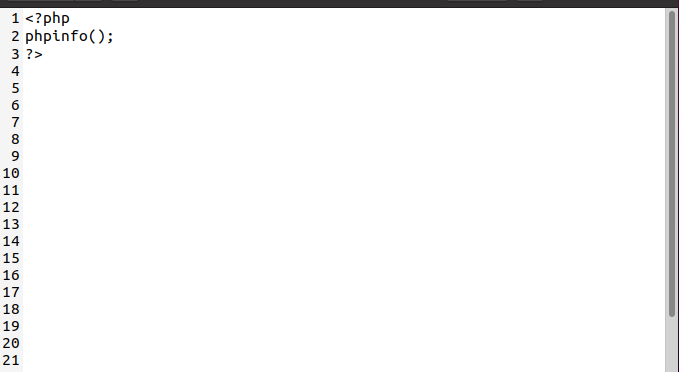
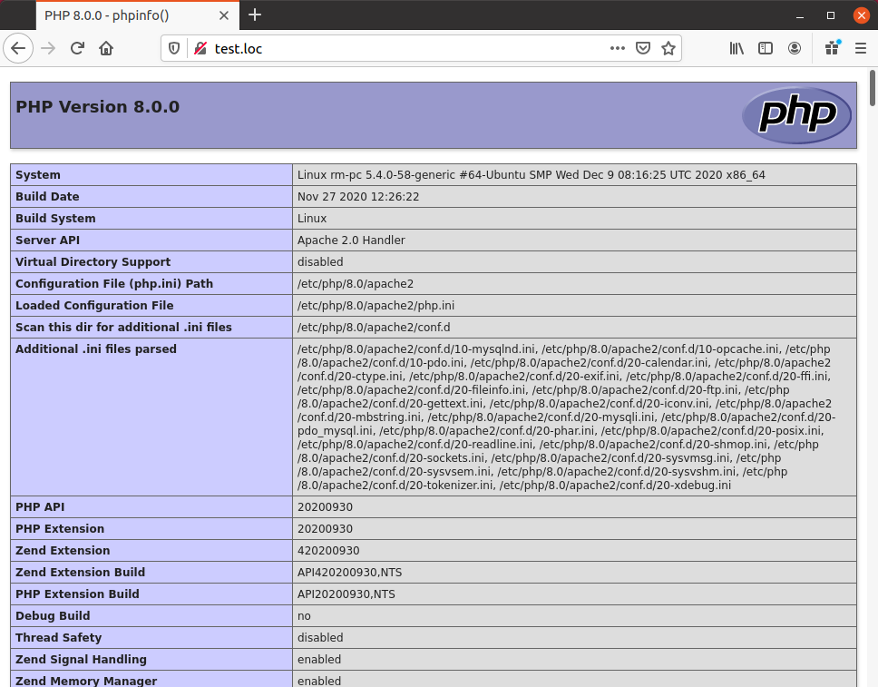

# 1.1 PHP Запуск кода и Первый скрипт

Первый скрипт на РНР будет достаточно простым, но уже он 
продемонстрирует совместное использование HTML и РНР. Для выделения РНР-кода
в HTML-документе используются специальные теги `<?php` и `?>`:

```php
<?php
echo "Код на PHP";
?>
```

## Замечание 

*Для выделения РНР-кода можно использовать также сокращенную форму `<?... ?>`,
для чего в конфигурационном файле `php.ini` следует включить режим `short_open_tag`.
Использование данного режима, однако, не рекомендуется, т.к. как разные 
web-серверы могут быть сконфигурированы по-разному, поэтому создаваемый таким образом код не является полностью переносимым. Кроме того, данный синтаксис может
конфликтовать с другими скриптовыми языками.*


Между этими тегами и размещается код на РНР. Код состоит из отдельных
операторов, каждый из которых завершается точкой с запятой. Использование
точки с запятой в конце оператора является _обязательным_, ее отсутствие 
вызовет сообщение об ошибке. В других языках, например, в JavaScript, точка с 
запятой не является обязательной в конце строки, но в РНР это строгое 
требование.

Наш первый скрипт состоит из единственного оператора `phpinfo()`. Ниже
будет показано, что в РНР предусмотрены самые разнообразные операторы
на все случаи жизни. В данном случае используется функция `phpinfo()` для 
отображения сведений о версии и конфигурации используемого варианта РНР.
Функция представляет собой последовательность операторов, иногда 
достаточно длинную, которая обозначена определенным именем, по которой она может
быть вызвана в любом месте программы. Функция `phpinfo()` является одной
из многих встроенных функций PHP. Ниже приведен пример вызова данной
функции:

```php
<?php
phpinfo();
?>
```

Данный текст следует ввести в любом текстовом редакторе, например,
в WordPad, и сохранить под именем `phpinfo.php`. Следует 
убедиться, что файл сохранен в текстовом формате, в противном случае он не будет
корректно обработан РНР. Одним из способов проверить правильность 
сохранения файла является его вывод при помощи команды TYPE в командной строке
Windows.

После создания файла его следует загрузить на хостинг при помощи FTP или
web-интерфейса. В случае локальной работы необходимо скопировать его в 
каталог документов web-сервера. Для Apache это подкаталог `htdocs` (если в 
настройках не указано иное), для IIS по умолчанию это каталог `inetpub/wwwroot`,
в операционной системе Linux этот каталог может называться `/var/www/html`.
После чего можно переходить непосредственно к запуску скрипта.



## Запускпервого скрипта

Для запуска скрипта следует ввести полный путь к нему в адресной строке
браузера. При работе с хостингом адрес может выглядеть примерно так:
`http://www.oursite.com/phpinfo.php`. В случае локальной установки адрес
будет наподобие следующего: `http://localhost/phpinfo.php`.

**Замечание**

*Не следует открывать файл `phpinfo.php` в браузере при помощи команды «`Файл\Открыть`», так как в этому случае скрипт не будет выполнен, а вместо него будет 
отображено его содержимое в виде текстового файла. Для запуска скрипта следует 
использовать корректный URL в адресной строке браузера.*

Если все настроено и выполнено корректно, на экране будут отображено 
множество таблиц с настройками РНР, как показано на рисунке ниже. Если используется
хостинг, то эта страница окажет существенную помощь в выяснении 
конкретных настроек РНР у данного провайдера.



## Возможные проблемы

При запуске первого скрипта может возникнуть множество проблем. 
Результатом выполнения скрипта может явиться сообщение об ошибке, пустая 
страница или еще что-либо непонятное, в любом случае проблема может быть решена.
Прежде всего следует убедиться в том, что РНР запускается. В случае 
локальной установки все просто — следует перейти в каталог, где установлен РНР,
и выполнить команду `php -v`. Если на экране отображается версия продукта,
все в порядке. Если хостинг-провайдер предоставляет консольный доступ
к web-серверу при помощи `Telnet` или `SSH2`, такую же проверку можно 
выполнить и удаленно.

Следующей, и наиболее часто встречаемой проблемой, является 
некорректная интеграция РНР и web-сервера. В этом случае вместо результата 
отображается чистая страница, а при просмотре HTML-кода в браузере виден исходный
PHP-код. Для устранения этой проблемы следует еще раз пройти по всей 
инструкции по установке РНР от начала до конца — возможно, какой-то важный
шаг не был выполнен. Следует иметь в виду, что после некоторых настроек 
может потребоваться перезапуск системной службы или всего компьютера (такие
вещи не всегда указывают в документации).

Наконец, следует убедиться в том, что файл размещен именно в том каталоге,
который предназначен для хранения HTML-документов web-сервера. 
Некоторые хостинг-провайдеры используют нестандартное расширение для
PHP-скриптов, например, `.php5.`

**Замечание**

*В операционных системах UNIX не требуется использование специальных режимов
файлов для PHP-скриптов. Их не следует помечать как исполняемые файлы, для них
достаточно использовать режим 644 (не 755).*
При использовании Microsoft Internet Information Server (IIS) следует 
убедиться в наличии в конфигурационном файле `php.ini` строки
«`cgi . forceredirect = 0`». Если такая строка отсутствует, следует добавить
ее в файл.
Наконец, имеет смысл обратиться к соответствующему разделу 
документации, в котором описаны возможные проблемы и методы их решения. Можно
также обратиться к PHP FAQ (Frequently Asked Questions — частые вопросы
и ответы) по адресу `www.php.net/faq.php`, раздел, посвященный установке,
находится по адресу `www.php.net/manual/faq.installation`. Если ничего
не помогает, можно попробовать задать вопрос экспертам в новостных группах
`alt.php` или `comp.lang.php`.
