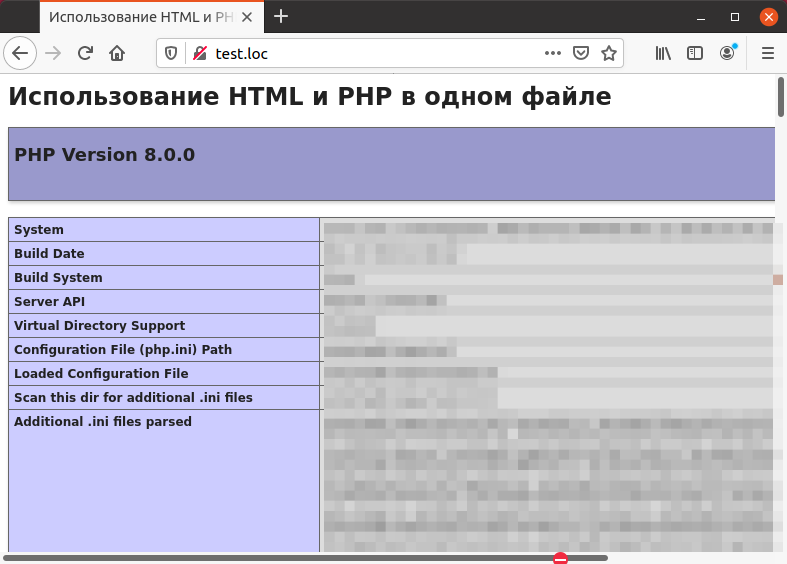
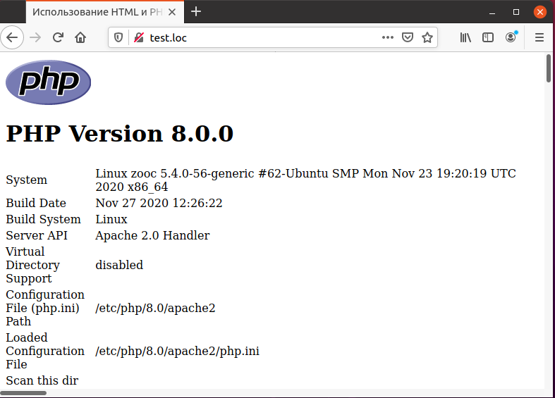

# 1.2 PHP и HTML

PHP-файлы обычно представляют собой смесь **HTML** и **РНР**. Это не создает
проблем, так как РНР-код всегда заключается внутри тегов `<?php ... ?>`, что
позволяет серверу легко идентифицировать его.
При использовании обычного HTML-кода все достаточно просто — 
web-сервер посылает текст страницы браузеру, который интерпретирует HTML-теги
и отображает результат на экране. С **РНР** всё становится немного сложнее.
РНР-код выполняется при помощи **РНР**, и если этот код формирует какой-либо
текст для отображения, он вставляется на то место, где размещался РНР-код.
В любом случае РНР-код удаляется перед отправкой готовой странице
клиентскому браузеру.
Пример, приведенный ниже, демонстрирует эту технологию в действии. Текст примера 
содержит несколько HTML-тегов, например, тег `<H1>`, который предназначен для 
формирования заголовка.

## Пример. Совместное использование **РНР** и **HTML**.

```php
<HTML>
  <HEAD>
    <TITLE>Использование HTML и РНР в одном файле</TITLE>
  </HEAD>
  <BODY>
    <H1>Использование HTML и РНР в одном файле</H1>
    <?php
    phpinfo();
    ?>
  </BODY>
</HTML>
```

После тега `<Н1>` расположен PHP-код, который выполняется, а его 
результат — сформированная таблица с параметрами настройки РНР — размещается
после заголовка. Результат выполнения примера представлен на рисунке ниже.



Для того, чтобы PHP-страница выглядела более строго, можно добавить один
из логотипов, доступных для закачки по адресу `www.php.net/down-
load-logos.php`. После загрузки логотипа (например, РНР.GIF) его можно 
использовать в коде при помощи тега :

```php
<HTML>
  <HEAD>
    <TITLE>Использование HTML и РНР в одном файле<TITLE>
  </HEAD>
  <BODY>
    <H1>Использование HTML и РНР в одном файле</H1>
    <?php
    phpinfo();
    ?>
    
  </BODY>
</HTML>
```

Результат выполнения этого кода показан на рис ниже.



# Отображение текста

Оператор `echo`, который предназначен для отображения произвольного 
текста на web-странице, является, пожалуй, самым гибким и наиболее 
употребительным оператором **РНР**. Простейшее его использование выглядит 
следующим образом: после ключевого слова `echo` следует поместить строку в 
кавычках, например:

```php
<HTML>
  <HEAD>
  <TITLE>Использование оператора echo</TITLE>
  </HEAD>
  <BODY>
    <H1>Отображение текста</H1>
    <?php
    echo "Привет от РНР!";
    ?>
  </BODY>
</HTML>
```

PHP-код может располагаться в произвольном месте и многократно 
включаться в HTML-страницу, что видно из примера ниже.

## Пример. Использование оператора echo.

```php
<HTML>
  <HEAD>
    <TITLE>Использование оператора echo</TITLE>
  </HEAD>
  <BODY>
    <H1>Отображение текста</H1>
    <?php
    echo "Привет от РНР!";
    ?>
    <H1>Отображение дополнительного текста</H1>
    <?php
    echo "Снова привет от РНР!";
    ?>
    
  </BODY>
</HTML>
```

Рисунок ниже показывает результат выполнения этого примера.
Текст может быть заключен как в простые кавычки (апострофы), так
и в двойные кавычки. Для отображения чисел кавычки не являются 
необходимыми, например:

`echo 111555;`

Так как любой вывод оператора `echo` (за исключением запуска **РНР** в 
командной строке) передаются браузеру, с его помощью можно также 
формировать и HTML-теги, например, ниже используется тег `<BR>` для перехода на 
новую строку:

`echo "Hello<BR>from<BR>PHP.";`


# Возможности отображения текста

Между отображением текста в командной строке и в окне браузера имеются
отличия. В браузере для форматирования текста используются HTML-теги, 
например, `<BR>` или `<P>`. Если используется командная строка, то для 
форматирования применяются специальные символы, для использования которых 
строку следует заключать в двойные кавычки. Они перечислены ниже:

* \n Перевод строки (LF), код символа ASCII — 10 (ОхОА).
* \r Возврат каретки (CR), код символа ASCII — 13 (OxOD).
* \t Табуляция (НТ), код символа ASCII 9 @x09).
* \\ Обратный слеш.
* \$ Знак доллара.
* \" Двойная кавычка.
* \0 . . . \777 Символ, код которого задан восьмеричным числом.
* \x0 . . . \xFF Символ, код которого задан шестнадцатеричным числом.


Например, оператор `echo "Line 1 \n Line 2"` при выполнении в командной
строке выведет `"Line 1"` на одной строке и `"Line 2"` — на другой. В браузере 
символ «`\n`» будет рассматриваться точно так же, как и пробел. Для достижения
того же самого результата при формировании HTML-страницы следует 
использовать оператор `echo "Line1 <BR> Line 2"`.

## Замечание

*При отображении тексте, сформированного при помощи скрипта, в браузере следует иметь ввиду, что его следует форматировать с использованием HTML-тегов. 
Использование простых переводов строки не приведет к желаемому эффекту, так как
браузер не отличает переводы строки отпростых пробелов, точно также как и в 
простом НТМL-документе. Только использование корректных HTML-тегов (например,
`<BR>` позволит добиться желаемого результата.*

При необходимости длинная строковая константа может быть размещена на
нескольких строках в тексте скрипта, и при выводе текста в командной строке
переводы строк будут сохранены. При формировании аналогичного текста для
браузера переводы строк будут игнорироваться:

```php
<?php
echo "Этот текст
занимает
несколько
строк.";
?>
```

Отдельные строки могут разделяться запятыми, например:
`echo "Привет,", "это", " Р Н Р . " ;`
Все эти строки будут отображены слитно, без разрывов:
`Привет,этоРНР.`
Если требуется отделить строки друг от друга пробелами, их следует 
включить внутри кавычек:
`echo "Привет, ", "это ", "Р Н Р . ";`
В результате будет выведено:
`Привет, это РНР.`
Строки также могут объединяться при помощи оператора конкатенации
(`«.»`). В результате образуется выражение, которое вычисляется и передается
оператору `echo` как единственный аргумент, например:
`echo "Привет, "."это "."РНР.";`
Для отображения кавычки, которая обычно используется для завершения
строки, следует разместить перед ней обратный слеш, например:
`echo "Она сказала: \ "Я люблю мороженое . \ "" ;`
Вместо оператора `echo` можно использовать функцию `print`, которая 
используется точно так же. Единственная разница между `echo` и `print` состоит
в том, что `print` является функцией и возвращает значение.
Значение, возвращаемое функцией `print`, всегда равно `1`. С точки зрения 
практической применимости различий между `echo` и `print` нет.

## Синтаксис heredoc

Для отображения большого объема текста можно использовать т.н. 
синтаксис `heredoc`. Он начинается с символов `<<<`, после которых следует 
произвольный идентификатор. Далее располагается текст, в конце которого начиная
с первого символа строки размещается тот же самый идентификатор. 
Использование данной возможности демонстрирует пример ниже.

## Пример. Использование синтаксиса hегеdос,

```php
<HTML>
  <HEAD>
      <TITLE>Использование синтаксиса heredoc</TITLE>>
  </HEAD>
  <BODY><H1>Использование синтаксиса heredoc</H1>
    <?php
    echo <<< END
    Этот пример
    демонстрирует использование
    синтаксиса "heredoc"
    для отображения текста
    большого объема до тех пор,
    пока не будет найден
    маркер окончания текста.
    END;
    ?>
  </BODY>
</HTML>
```