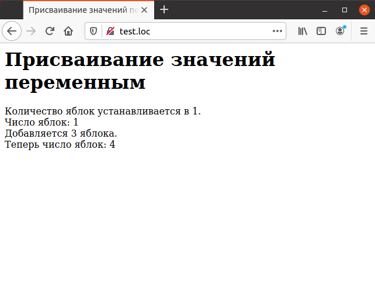
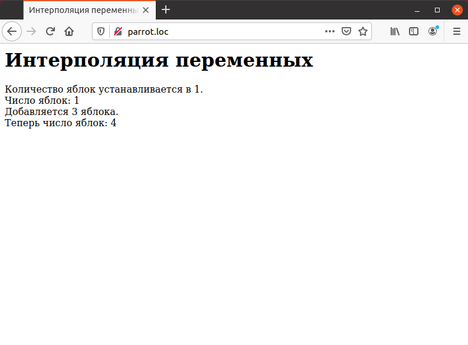
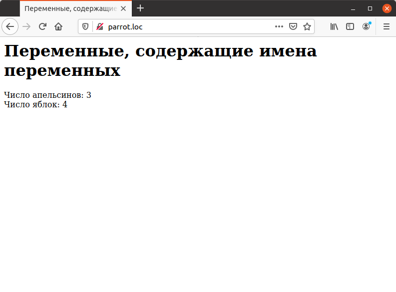

# 1.2 PHP Переменные: создание, интерполяция в строках, имена переменных в переменных 

Текст, отображаемый до сих пор, был неизменным, например:

```php
<?php
echo "Привет от РНР";
?>
```

Но РНР предназначен далеко не только и не столько для формирования 
статичного текста. Для того, чтобы обрабатывать различные данные, в языке 
предусмотрены переменные.
Переменные являются контейнерами для данных. Каждая переменная 
содержит определенное значение. Например, пусть требуется отобразить 
текущую температуру. В случае использования постоянных значений — констант —
соответствующий код мог бы выглядеть следующим образом:

```php
<?php
echo "Температура сегодня: ", 36;
?>
```

При использовании переменной этот же код примет следующий вид:

```php
<?php
echo "Температура сегодня: ", $temperature;
?>
```

Переменные предназначены для хранения данных под определенным 
идентификатором — именем переменной. В РНР имена переменных начинаются со
знака доллара (`«$»`), далее следует буква или знак подчеркивания, после 
которого может следовать произвольное количество букв, цифр или знаков 
подчеркивания. После ее создания доступ к переменной возможен в произвольном
месте скрипта. Самое время перейти к созданию переменных.


# Создание переменных


Переменная создается тогда, когда ей присваивается какое-либо значение.
Для присвоения значения переменной в РНР используется оператор 
присваивания., виды которого подробно описаны в гл. 2. Наиболее часто употребительная
форма оператора присваивания состоит из знака равенства (`« = »`). Ниже 
приведены примеры операторов присваивания, которые создают соответствующие
переменные:

```php
<?php
$temperature = 24;
$number_of_earths = 1;
$pi = 3.1415926535;
$reassurance = "Без паники!";
$message = "Доброе утро!";
```

Обратите внимание, что одним переменным присвоены числа, а другим —
строки. В других языках программирования переменные требуют явного 
описания с указанием их типа, но РНР — язык с нестрогой типизацией переменных,
что упрощает программирование на нем.


## Замечание


*При сохранении значений различных типов компьютер использует различное внутреннее представление данных,поэтому в некоторых случаях следует обращать внимание на тип переменных и выражений. См.также раздел [«Типы данных»](1.7_Tipy_dannyh.md).
главе.*

Рассмотрим пример 1.4. В нем переменной `$apples` сперва присваивается
значение `1`, которое потом отображается:

```php
<?php
$apples = 1;
echo "Число яблок: ", $apples, "<BR>";
```

После этого значение переменной увеличивается на три, и результат снова
отображается на экране

```php
<?php
$apples = 3;
echo "Теперь число яблок: ", $apples, "<BR>";
```


## Пример 1.4. Присваивание значений переменным.


```php
<HTML>
  <HEAD>
    <TITLE>Присваивание значений переменным</TITLE>
  </HEAD>
  <BODY>
    <H1>Присваивание значений переменным</H1>
    <?php
    echo "Количество яблок устанавливается в 1.<BR>";
    $apples = 1;
    echo "Число яблок: ", $apples, "<BR>";
    echo "Добавляется 3 яблока.<BR>";
    $apples = $apples + 3;
    echo "Теперь число яблок: ", $apples, "<BR>";
    ?>
  </BODY>
</HTML>
```

Результат выполнения этого примера приведен на ниже. Как видно, 
присваивать значение переменным и изменять эти значения достаточно просто.




# Интерполяция переменныхвстроках


Значение переменной может быть отображено, например, следующим 
способом:

```php
$apples = 1;
echo "Число яблок: ", $apples, "<BR>";
```

Но существует способ сделать это проще. Если имя переменной заключено
в двойные (не одинарные) кавычки, то переменная интерполируется. Это 
означает, что имя переменной заменяется ее значением, которое помещается на то
же место в строке, где стояло имя переменной. Этот способ проиллюстрирован
ниже:

```php
<?php
$apples = 1;
echo "Число яблок: $apples, <BR>";
```

Пример 1.5 повторяет пример 1.4, но с использованием интерполяции 
переменных.


## Пример 1.5. Интерполяция переменных.


```php
<HTML>
  <HEAD>
    <TITLE>Интерполяция переменных</TITLE>
  </HEAD>
  <BODY>
    <H1>Интерполяция переменных</H1>
    <?php
    echo "Количество яблок устанавливается в 1.<BR>";
    $apples = 1;
    echo "Число яблок: $apples <BR>";
    echo "Добавляется 3 яблока.<BR>";
    $apples = $apples + 3;
    echo "Теперь число яблок: $apples <BR>";
    ?>
  </BODY>
</HTML>
```

Рис. 1.9 содержит результат выполнения этого примера.
Существует одна тонкость при использовании интерполяции переменных.
Рассмотрим следующий пример:

```php
<?php
$text = "news";
echo "Where's the", $textpaper, "<BR>";
?>
```

Ожидается, что имя переменной `$text` будет заменено на ее значение.
Но этого не происходит, вместо этого выдается сообщение об ошибке:

>PHP Notice: Undefined variable: textpaper in C:\php\t.php on line 4


Рис. 1.9. Интерполяция переменных в строках

Это происходит потому, что РНР анализирует наличие имени переменной 
согласно синтаксическим правилам и всегда выделяет максимально возможное по
длине имя. Для того, чтобы указать, какую именно переменную следует 
интерполировать в этом случае, следует использовать фигурные скобки, как показано
в примере 1.6.


## Пример 1.6. Интерполяцияпеременных в сплошном тексте.


```php
<HTML>
  <HEAD>
    <TITLE>Интерполяция переменных</TITLE>
  </HEAD>
  <BODY>
    <H1>Интерполяция переменных</H1>
    <?php
    $text = "news";
    echo "Whehe is the {$text} paper";
    ?>
  </BODY>
</HTML>
```


# Переменные, содержащие имена переменных


РНР позволяет размещать в переменных не только простые значения, но
и имена других переменных. Пусть, например, создана переменная `$apples:`

```php
<?php
$apples = 4;
?>
```

Далее создается переменная `$fruit name`, которая содержит имя переменной

```php
<?php
$apples = 4;
$fruitname = "apples";
?>
```

После этого к переменной `$apples` можно обратиться как `$$fruitname:`

```php
<?php
$apples = 4;
$fruitname = "apples";
echo "Число яблок: ", $$fruitname;
?>
```

Для корректной интерполяции подобных переменных в строковых 
константах, заключенных в двойные кавычки, следует также использовать фигурные
скобки, например: "`${$fruitname}`" . Пример 1.7 показывает использование
этих приемов.


## Пример 1.7. Переменные, содержащие имена переменных.


```php
<HTML>
  <HEAD>
    <TITLE>Переменные, содержащие имена переменных</TITLE>
  </HEAD>
  <BODY>
    <H1>Переменные, содержащие имена переменных</H1>
    <?php
    $apples = 4;
    $oranges = 3;
    $fruitname = "oranges";
    echo "Число апельсинов: ${$fruitname} <BR>" ;
    $fruitname = "apples";
    echo "Число яблок: ${$fruitname} <BR>";
    ?>
  </BODY>
</HTMLL>
```


Результат выполнения примера отображен на рисунке ниже.



Если бы фигурные скобки отсутствовали, результат выполнения примера 1.7
был бы следующим:

```php
Число апельсинов: $oranges
Число яблок: $apples
```

Переменные, содержащие имена переменных, могут выглядеть курьезом, но
на самом деле они могут быть очень полезны, что показано далее в гл. 3.
