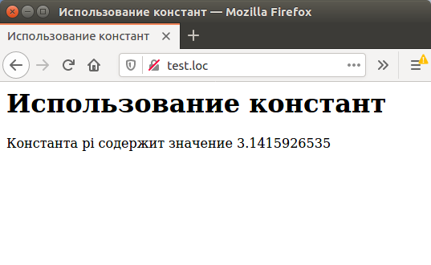

# 1.3 PHP Константы и ключевые слова 

## Константы (неизменяемые значения)

Иногда не требуется менять один раз заданное значение переменной, а напротив требуется,
 чтобы это значение не изменялось после определения, как раз для таких ситуаций в PHP есть _константы_.

Например, после присваивания переменной `$pi` значения числа `n`, имеет смысл предотвратить его случайное изменение в другом фрагменте скрипта. 
Для этого используются константы — их значения не могут быть изменены в процессе выполнения скрипта.

Для описания константы используется функция `define()`, которой передается
имя константы и ее значение, например:

```php
define("pi", 3.1415926535);
```

Обратите внимание, что имя константы всегда заключается _в кавычки_, а значение только тогда, когда оно является строкой (подробнее о типах данных мы поговорим в следующих разделах этого учебника). 
Кроме того, при использовании константы перед ней не ставится знак доллара. 

Приведем ниже пример кода и результат его выполнения:

```php
<HTML>
    <HEAD>
    <TITLE>
        Использование констант
    </TITLE>
    </HEAD>
    <BODY>
    <H1>
        Использование констант
    </H1>
    <?php
        define("pi", 3.1415926535);
        echo "Константа pi содержит значение ", pi,  "<BR>";
    ?>
    </BODY>
</HTML>
```

В результате выполнения этого скрипта получим в браузере следующую страницу:



Попытка изменения значения константы приведет к ошибке перед началом выполнения скрипта — он даже не будет запущен.

## Ключевые слова 

Так как перед именем константы не ставится знак доллара, в качестве имени константы не следует использовать <em>зарезервированные слова</em> языка РНР. 

Неполный список зарезервированных  слов приведен ниже (также их называют "ключевыми словами"):

```php
_CLASS_  _FILE_     _FUNCTION_  _LINE_          _METHOD_
and      default    endif       global          print
array    die        endswitch   if              require
as       do         endwhile    include         require_once
break    echo       eval        lnclude_once    return
case     else       exception   isset           static
class    elseif     exit        list            switch
const    empty      extends     new             unset
continue enddeclare for         or              use
declare  endfor     foreach     php_user_filter while
         endforeach function                    xor
```

(вам не требуется запоминать его весь -- часть слов вы выучите по мере изучения материала, 
а к остальным всегда можно обратиться <a href="https://www.php.net/manual/ru/reserved.keywords.php">к оф. документации по ключевым словам</a>).

## Предопределенные константы

Существует несколько предопределенных констант (т.е. таких, которые уже определены в php, не зависимо от вашего кода), которые можно использовать при разработке скриптов. 
Вот некоторые из них:
<ul>
  <li><code>__LINE__</code>   -- Номер текущей строки скрипта.</li>
  <li><code>__FILE__</code>   -- Полное имя файла текущего скрипта.</li>
  <li><code>__FUNCTION__</code>   -- Имя текущей исполняемой функции (добавлено
начиная с РНР 4.3.0).</li>
  <li><code>__CLASS__</code>   -- Имя текущего класса (добавлено начиная
 с РНР4.3.0).
  </li>
  <li><code>__METHOD__</code>  -- Имя текущего метода класса (добавлено начиная
СРНР5.0.0).</li>
  <li><code>PHP_VERSION</code>  -- Версия РНР.</li>
  <li><code>PHP_OS</code> -- Операционная система, под управлением которой работает РНР.</li>
  <li><code>DEFAULT_INCLUDE_PATH</code> -- Список путей, в которых РНР ищет 
подключаемые файлы.
  </li>
</ul>
