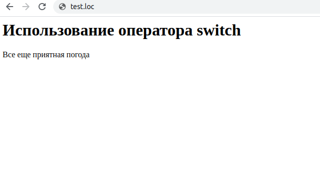

## 2.14 Оператор SWITCH  
При проверке большого количества условий даже использование оператора
`if... elseif` может стать несколько утомительным. В таких случаях на 
помощь приходит оператор `switch`, предназначенный для сравнения заданного  выражения с различными вариантами значений.  

Оператор начинается с ключевого слова `switch`, за которым в скобках 
записывается некоторое выражение. Далее после ключевого слова `case` 
перечисляются возможные варианты значений. В случае совпадения  результата вычисления выражения с каким-либо значением, выполняются операторы, записанные ниже, вплоть до оператора `break`. Если результат вычисления выражение не совпал ни с одним из значений, заданных после `case`, выполняются операторы, расположенные после ключевого слово `default`.  

 Впрочем, секция `default` может и отсутствовать, тогда в таком случае никаких действий не выполняется. Ниже приведен пример использования оператора `switch` для анализа температуры.
```php  
$temperature = 25;
switch ($temperature)
{
    case 25 :
        echo "Приятная погода";
        break;
    case 26 :
        echo "Все еще приятная погода";
        break;
    case 27 :
        echo "Становится теплее";
        break;
    default :
        echo "Температура за заданными пределами";
        break;
}
```  
В результате выполнения этого примера на экран будет выведена строка  

Приятная погода  

Следует иметь в виду, что после case могут располагаться только значения целого, вещественного или строкового типов.
Но что если требуется выполнить одно и то же действие при нескольких 
значениях выражения? В этом случае можно использовать несколько подряд идущих конструкций `case`. Это иллюстрирует пример 2.6, в котором температура анализируется на принадлежности диапазонам 24-26, 27-29 и т. д.  

 Пример 2.6. Использование оператора `switch` 
```php 
<HTML>
    <HEAD>
        <TITLE>
            Использование оператора switch
        </TITLE>
    </HEAD>
    <BODY>
        <H1>
        Использование оператора switch
        </Hl>
        <?php
        $temperature = 27;
        switch ($temperature)
        {
            case 24:
            case 25:
            case 26:
                echo "Приятная погода";
                break;
            case 27:
            case 28:
            case 29:
                echo "Все еще приятная погода";
                break;
            case 30 :
            case 31:
            case 32:
                echo "Становится жарковато" ;
                break;
            default:
                echo "Температура вне заданных пределов" ;
        }        
        ?>
    </BODY>
</HTML>
``` 
На рис. 2.7 представлен результат выполнения этого примера.  

```