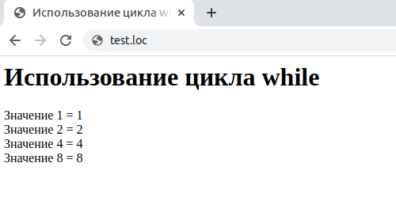

## 2.16 Циклы WHILE  и  DO...WHLIE
Другим типом циклов являются циклы `while`. Вместо использования счетчика цикла, цикл проверяется некоторое условие и выполняется до тех пор, пока оно остается истинным. Ниже приведен синтаксис цикла `while`.
```php
while (expression) statement
```  
Оператор *statement*, образующий тело цикла, может быть как простым, так и составным. Условие проверяется перед вьшолнением тела цикла, так что если оно будет ложным с самого начала, цикл не выполнится ни разу. Как легко догадаться, тело цикла должно оказывать какое-то влияние на условие, чтобы предотвратить образование бесконечного цикла (зацикливание). Пример 2.8 иллюстрирует использование цикла `while`. В данном примере на экран выводится значение переменной `$value` до тех пор, пока оно не превысит 10, при этом значение удваивается при каждом выполнении тела цикла. Перед вьшолнением цикла переменная инициализируется (в противном случае ей бьшо бы по умолчанию присвоено значение 0, что автоматически привело бы к бесконечному циклу).  

Пример 2.8. Использование цикла `while`
```php
<HTML>
    <HEAD>
        <TITLE>
            Использование цикла while
        </TITLE>
    </HEAD>
    <BODY>
        <H1>
            Использование цикла while
        </H1>
        <?php
            $value = 1 ;
            while ($value < 10)
            {
                echo "Значение $value = ", $value, "<BR>";
                $value *= 2 ;
            }
        ?>
    </BODY>
</HTML>
``` 
Результат выполнения примера приведен на рис. 2.9  

*****  
Данный тип цикла часто используется в том случае, если в цикле отсутствует явно заданный счетчик. Например, при чтении данных из файла обычно используется функция для проверки достижения конца файла. Ниже приведен пример подобного использования цикла `while` при помощи гипотетических функций. Обратите внимание, что в теле цикла происходит считывание данных (и тем самым продвигается указатель файла). Если этого не сделать, цикл станет бесконечным.
```php 
open_flle ();
while (! end_of_file ())
{
   $data = read_data () ;
   echo $data;
}
```  
## Циклы DO...WHILE
Наряду с циклами `while` в PHP присутствуют и циклы `do...while`. 
Основное их отличие состоит в том, что условие цикла проверяется не до, а после того как тело цикла будет выполнено, что отражается и в синтаксисе оператора:
```php
do
  statement
while (condition)
```
Ниже приведен пример из предыдущего раздела, только с использованием
оператора цикла `do...while`:
```php
$value = 1;
do
{
   echo $value, "<BR>";
   $value *= 2;
}
while ($value < 10);
```
Отличие между циклами `while` и `do...while` на самом деле весьма существенно. Если условие цикла изначально ложно, то цикл `while` не выполнится ни один раз, а тело цикла `do ... while` будет выполнено однократно. Например, следующий цикл не выводит на экран ничего:
```php
$value = 20;
while ($value < 10)
{
   echo $value, "<BR>";
   $value *= 2;
}
```
В тоже время после выполнения следующего примера на экран будет выведено число `«20»`:
```php
$ value = 20;
do
{
   echo $value, "<BR>";
   $value *= 2;
}
while ($value < 10);
```