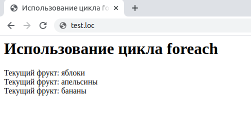

## 2.17 Циклы FOREACH
Для упрощения обработки массивов предусмотрен специальный тип 
цикла — оператор `foreach`. Массивы будут рассматриваться более подробно в следующей главе, а здесь они будут лишь бегло упомянуты. Массивы состоят из отдельных элементов, и цикл `foreасh` предназначен для перебора всех элементов массива без использования счетчика цикла. Ниже приведен синтаксис этого оператора:  
```php 
foreach (array as $value) statement
foreach (array as $key => $value) statement
```
Пример 2.9 демонстрирует применение данного типа циклов для 
последовательного вывода на экран всех элементов массива `$агг`.  
 

```php
<HTML>
    <HEAD>
        <TITLE>
            Использование цикла foreach
        </TITLE>
    </HEAD>
    <BODY>
        <H1>
            Использование цикла foreach
        </H1>
        <?php
        $arr = array ("яблоки", "апельсины", "бананы");
        foreach ($arr as $value)
        {
            echo "Текущий фрукт: $value<BR>";
        }
        ?>
    </B0DY>
</HTML>
```  
Результат выполнения примера представлен на рис. 2.10. Особенности 
данного типа циклов будут более подробно освещены в гл.3.  




