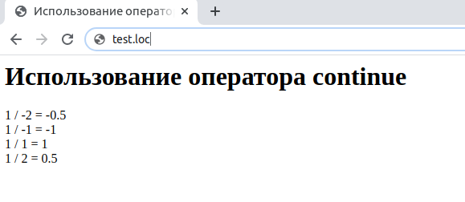

## 2.19 Оператор CONTINUE
Наконец, предусмотрена возможность досрочного перехода к началу цикла,
не выполняя все тело цикла целиком. Для этого используется оператор
`continue`. Его применение продемонстрировано в примере 2.10, который 
выводится на экран числа, обратные к счетчику цикла. Оператор `continue` используется для предотвращения деления на ноль, что неминуемо вызвало бы сообщение о математической ошибке.  

Пример 2.10. Использование оператора continue  

```php
<HTML>
    <HEAD>
        <TITLE>
            Использование оператора continue
        </TITLE>
    </HEAD>
    <BODY>
        <H1>
           Использование оператора continue
        </H1>
        <?php
            for ($value = -2; $value < 3; $value++)
            {
                if($value == 0)
                {
                    continue;
                }
                echo "1 / $value = ", 1 / $value, "<BR>";
            }
        ?>
    </BODY>
</HTML>  
```

Результат выполнения примера представлен на рис. 2.11. Обратите 
внимание, что деление на ноль не произошло !  


  
*****