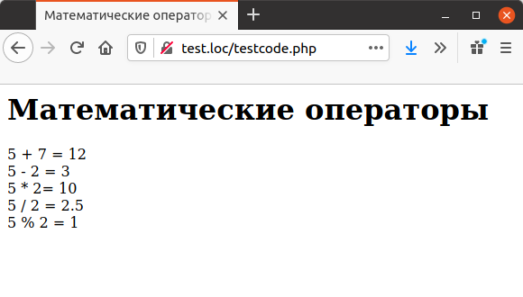
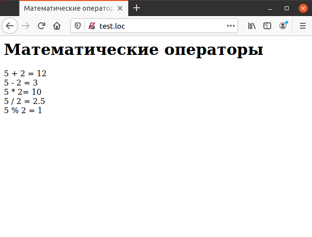

# 2.1 PHP Математические операторы и математические функции

Предыдущая глава посвящена введению в язык РНР, а в данной главе описываются основные операторы языка. Во-первых, к ним относятся операторы обработки данных—арифметические, строковые и битовые. Например, при работе с численными данными широко используются операторы сложения («+»), вычитания («-»), умножения («*») и т.д. Все операторы перечислены в табл. 2.1.
Во-вторых, ниже описываются также основные управляющие конструкции языка — условные операторы и операторы циклов. При помощи условного оператора можно выполнять те или иные фрагменты кода в зависимости от значения некоторого условия. Наличие подобных средств в языке позволяют формировать динамические HTML-страницы, для чего прежде всего и предназначен язык РНР. При помощи циклов становится возможным эффективно обрабатывать большие объемы данных. Эта тема раскрывается далее в гл. 3, где описывается работа со строками и массивами.

## Математические операторы

Численные данные обрабатываются при помощи следующих 
фундаментальных операторов языка РНР:

* `+`      Сумма двух чисел.
* `-`       Разность двух чисел.
* `*`       Произведение двух чисел.
* `/`      Частное от деления двух чисел.
* `%`      Остаток отделения одного числа на другое (частное по модулю).

Пример демонстрирует использование математических операторов языка.

```php
<HTML>
    <HEAD>
    <TITLE>
        Математические операторы
    </TITLE>
    </HEAD>
    <BODY>
        <H1>
            Математические операторы
        </H1>
        <?php
            echo "5 + 2 = ",5 + 7, "<BR>"; 
            echo "5 - 2 = ", 5 - 2, "<BR>";
            echo "5 * 2= ", 5 * 2, "<BR>";
            echo "5 / 2 = ", 5 / 2, "<BR>";
            echo "5 % 2 = ", 5 % 2, "<BR>";
        ?>
    </B0DY>
</HTMI>
```

Результат выполнения данного примера представлен на изображении ниже:

<<<<<<< HEAD

Наряду с математическими операторами, в РНР предусмотрено большое количество математических функций. Ниже приведен перечень наиболее часто употребительных функций.
=======


>>>>>>> 6e8b6cbd156c3e9232efe1033bb6e3acff6e7c28

# Математические функции

Наряду с математическими операторами, в РНР предусмотрено большое количество математических функций. Ниже приведен перечень наиболее часто
употребительных функций.

* abs. Абсолютное значение (модуль) числа.
* acos. Арккосинус.
* acosh. Гиперболический арккосинус.
* as in. Арксинус.
* asinh. Гиперболический арксинус.
* atan2. Арктангенс частного двух переменных.
* atan. Арктангенс.
* atanh. Гиперболический арктангенс.
* base_convert. Преобразование чисел в строковом представлении из одной
системы счисления в другую.
* bindec. Преобразование строки, представляющей двоичное число, в 
целочисленное значение.
* ceil. Округление числа в большую сторону.
* cos. Косинус.
* cosh. Гиперболический косинус.
* decbin. Преобразование числа в двоичное представление в виде строки.
* dechex. Преобразование числа в шестнадцатеричное представление в виде
строки.
* decoct. Преобразование числа в восмеричное представление в виде строки.
* deg2 rad. Преобразование
cтроки.
* decoct. Преобразование числа в восмеричное представление в виде строки.
* deg2rad. Преобразование градусов в радианы.
* ехр. Вычисление экспоненты заданного числа.
* floor. Округление числа в меньшую сторону.
* fmod. Вещественный остаток от деления двух чисел.
* getrandmax. Максимальное значение, которое можно получить функцией
rand().
* hexdec. Преобразование строки, представляющей шестнадцатеричное
число, в целочисленное значение.
* hypot. Вычисление гипотенузы по двум катетам.
* is_finite. Проверка, является ли значение конечным вещественным
числом.
* is_infinite. Проверка, является ли значение бесконечностью (может
возникнуть, например, в результате вычисления значения логарифма
нуля).
* is_nan. Проверка, является ли значение специальным значением NAN
(not-a-number, результат выполнения некорректной математической 
операции).
* lcg_value. Генератор псевдослучайных чисел.
* loglO. Десятичный логарифм.
* log. Натуральный логарифм.
* max. Максимум заданных чисел.
* min. Минимум заданных чисел.
* mt_getrandmax. Максимальное значение, которое можно получить функцией mtr and ().
* mt_srand. Генератор псевдослучайных чисел по алгоритму витка Мерсен-
на.
* max. Максимум заданных чисел.
* min. Минимум заданных чисел.
* mt_getrandmax. Максимальное значение, которое можно получить 
функцией mtr and ().
* mt_rand. Генератор псевдослучайных чисел по алгоритму витка Мерсен-
на1.
* mt_srand. Инициализация генератора псевдослучайных чисел по 
алгоритму витка Мерсенна.
* octdec. Преобразование строки, представляющей восьмеричное число,
в целочисленное значение.
* pi. Значение числа и.
* pow. Возведение в степень.
* rad2deg. Преобразования радианов в градусы.
* rand. Генератор псевдослучайных чисел.
* round. Округление числа.
* sin. Синус.
* sinh. Гиперболический синус.
* sqrt. Квадратный корень.
* srand. Инициализация генератора псевдослучайных чисел.
* tan. Тангенс.
* tanh. Гиперболический тангенс.

Ниже приведен пример извлечения квадратного корня:

```php
<?php
   echo "sqrt(49) = ", sqrt(49);
?>
```
<<<<<<< HEAD

В результате выполнения данного фрагмента кода будет выведена следующая строка:
```php
sqrt(49) = 7
```
=======
В результате выполнения данного фрагмента кода будет выведена 
следующая строка:

```php
  sqrt (49) = 7
```
>>>>>>> 6e8b6cbd156c3e9232efe1033bb6e3acff6e7c28
