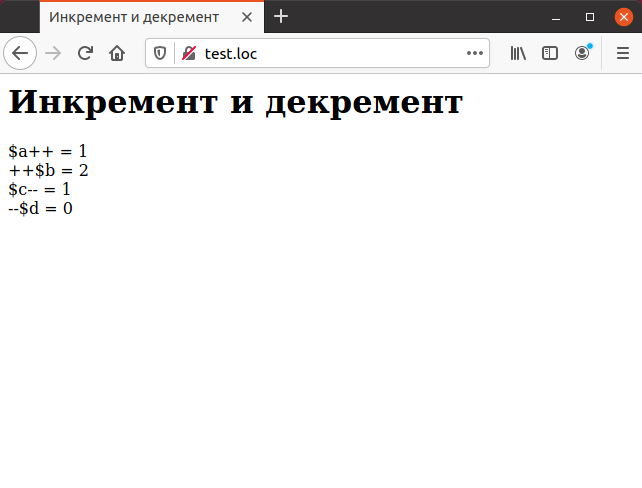

# 2.3 PHP Увеличение и уменьшение

Достаточно часто требуется увеличить или уменьшить значение некоторой
переменной на единицу. Особенно часто это используется в циклах, что будет 
показано ниже в этой главе. В РНР для этого предусмотрены специальные 
операторы. Для увеличения значения на единицу (инкремент) предназначен оператор
«`++`», а для уменьшения (декремент) — оператор «`--`».
Например, если переменная `$bananas` содержит значение `0`, то после 
инкремента ее при помощи конструкции вида `$bananas++` ее значение станет равным
`1`. Если переменная `$apples` содержит значение `11`, то после выполнения кода
`$apples--` ее значение станет равным `10`.
Операторы инкремента и декремента могут быть использованы как до 
(префиксная запись), так и после (постфиксная запись) имени переменной. Если 
используется префиксная запись, например, `++$bananas`, то значение переменной увеличивается, и это же значение используется как результат вычисления
данного выражения. При использовании постфиксной записи, например
`$bananas+ +`, результатом вычисления выражения становится значение 
переменной до ее увеличения. Разница между этими двумя вариантами 
представлена ниже:

`++$value` Пре-инкремент. Увеличивает значение `$value` на единицу.

`$value++` Пост-инкремент. Возвращает текущее значение `$value`, по-
еле чего увеличивает значение `$value` на
единицу.

`--$value` Пре-декремент. Уменьшает значение `$value` на единицу.

`$value--` Пост-декремент. Возвращает текущее значение `$value`, поcле чего уменьшает значение `$value` на
единицу.


## Пример. Инкремент и декремент.

```php
<HTML>
  <HEAD>
    <TITLE>Инкремент и декремент</TITLE>
  </HEAD>
  <BODY>
    <H1>Инкремент и декремент</H1>
    <?php
    $a = $b = $c = $d = 1;
    echo "\$a++ = ", $a++, "<BR>"; 
    echo "++\$b = ", ++$b, "<BR>";
    echo "\$c-- = ", $c--, "<BR>";
    echo "--\$d = ", --$d, "<BR>";
    ?>
  </BODY>
</HTML>
```

Результат выполнения данного примера показан на рисунке. Как видно, 
имеются различия между префиксным и постфиксным применением операторов
инкремента и декремента.
Если значение, возвращаемое операторами, не используется (например, при
увеличении значения счетчика цикла, как это показано ниже), то не имеет 
значения, какую форму операторов использовать — префиксную или 
постфиксную.


