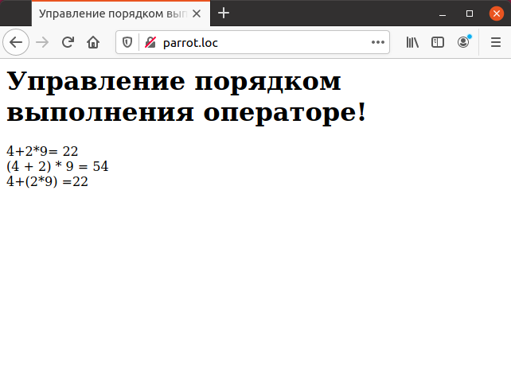

# 2.4 PHP Приоритет операторов
При использовании нескольких операторов совместно в одном выражении
возникает вопрос — в каком порядке они будут выполнены? Например, пусть
имеется следующий фрагмент кода:

```php
<?php
echo 4+2*9;
?>
```

Его результат будет зависеть от того, какой из двух операторов выполнится
первым — сложение или умножение. В данном случае результат будет равен `22`,
так как первым выполнится оператор умножения, потому что умножение имеет
более высокий приоритет по сравнению со сложением. В таблице ниже приведены
операторы по убыванию приоритета. Операторы с одним приоритетом 
выполняются по порядку слева направо.

## Таблица. Операторы в порядке убывания приоритета

>Операторы

* new
* ! ~ ++ - (int) (float) (string) (array) (object)
* @
* / %
* +-
* < >
* < <= > >=
* == != === !==
* &&
* ^
* 1
* ||
* ?
* = += =* =/=- % & <= >=
* print
* and
* xor
* or

Для изменения порядка выполнения операторов используются скобки. 
Пример ниже демонстрирует использование скобок для получения различного 
порядка выполнения арифметических операторов, и как следствие, для получения
различного результата.

## Пример. Управление порядком выполнения операторов.

```php
<HTML>
  <HEAD>
    <TITLE>Управление порядком выполнения операторов</TITLE>
  </HEAD>
    <BODY>
      <H1>Управление порядком выполнения операторе!</H1>
      <?php
        echo "4+2*9= ", 4+2*9, "<BR>";
        echo "(4 + 2) * 9 = " , (4 + 2) * 9, "<BR>";
        echo "4+(2*9) =", 4+(2*9), "<BR>";
      ?>
    </BODY>
</HTML>
```

На рисунке ниже приведен результат вычислений выражения с различным 
порядком выполнения арифметических операторов.

