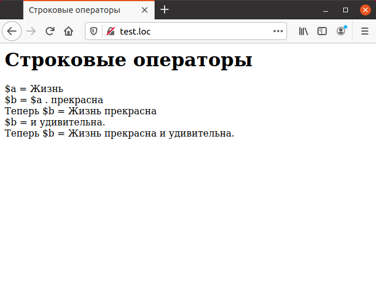

# 2.6 PHP Строковые операторы

В РНР существуют два строковых оператора. Первый — это оператор 
конкатенации (`«.»`), который объединяет две строки в одну. Второй — это 
конкатенирующий оператор присваивания, который добавляет строковый результат 
вычисления выражения справа к заданной переменной. В пример включены оба
этих оператора.

## Пример.

```php
<HTML>
  <HEAD>
    <TITLE>Строковые операторы</TITLE>
  </HEAD>
  <BODY>
    <H1>Строковые операторы</H1>
    <?php
    $a = "Жизнь ";
    echo "\$a = ", $a, "<BR>";
    echo "\$b = \$a . прекрасна", "<BR>";
    $b = $a . "прекрасна ";
    echo "Теперь \$b = ", $b, "<BR>";
    echo "\$b = и удивительна.","<BR>";
    $b .= "и удивительна.";
    echo "Теперь \$b = ", $b, "<BR>";
    ?>
  </BODY>
</HTML>
```

Результат выполнения данного примера приведен на рисунке. Но этими 
двумя операторами возможности РНР по обработке строк не ограничиваются.
В гл. 3 приведено большое количество функций, предназначенных для самых
разнообразных манипуляций со строками.


