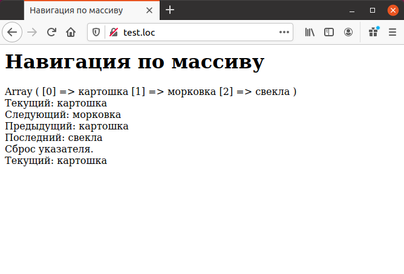

# Навигация по массивам

В РНР имеется ряд функций для навигации по массивам. Навигация 
осуществляется при помощи указателя текущего элемента массива. Например, 
имеется следующий массив:

```php
$vegetables[0] = "картошка";
$vegetables[1] = "морковка";
$vegetables[2] = "свекла";
```

Текущий элемент массива определяется при помощи функции `current()`. 
После создания массива его первый элемент становится текущим:

```php
echo "Текущий: ", current($vegetables), "<BR>";
```

Для перемещения указателя к следующему элементу используется функция
`next()`:

```php
echo "Следующий: ", next ($vegetables) , "<BR>";
```

Для перемещения указателя к предывдущему элементу используется 
функция `next()`:

```php
echo "Предыдущий: ", prev ($vegetables) , "<BR>";
```

Функция `end()` перемещает указатель к последнему элементу массива и 
возвращает его:

```php
echo "Последний: ", end ($vegetables) , "<BR>";
```

Для возврата указателя к началу массива используется функция `reset()`:

```php
reset($vegetables);
```

Использование всех этих функций показано в примере ниже.

## Пример. Навигация по массиву

```php
<HTML>
    <HEAD>
        <TITLE>Навигация по массиву</TITLE>
    </HEAD>
    <BODY><H1>Навигация по массиву</H1>
        <?php
        $vegetables[0] = "картошка";
        $vegetables[1] = "морковка";
        $vegetables[2] = "свекла";
        print_r($vegetables);
        echo "<BR>";
        echo "Текущий: ", current ($vegetables), "<BR>";
        echo "Следующий: ", next ($vegetables), "<BR>";
        echo "Предыдущий: ", prev ($vegetables), "<BR>";
        echo "Последний: ", end ($vegetables), "<BR>";
        echo "Сброс указателя.<BR>";
        reset($vegetables);
        echo "Текущий: ", current ($vegetables) , "<BR>";
        ?>
    </BODY>
</HTML>
```

Результат выполнения этого примера ниже.

