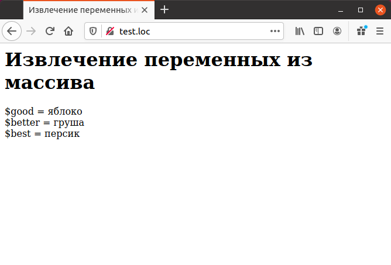

# Извлечение переменных из массивов


Если требуется для массива, проиндексированного строками, присвоить 
значения элементам переменным, одноименным с соответствующими индексами,
то на помощь приходит функция `extract()`. Например, имеется следующий 
массив:

```php
$fruits["good"] = "яблоко";
$fruits["better"] = "груша";
$fruits["best"] = "персик";
```

После вызова функции `extract()` будут созданы переменные `$good, $better`
и т.д., и им будут присвоены соответствующие значения из массива.
```php
extract($fruits);
```
Это легко наблюдать в примере ниже.

```php
<HTML>
    <HEAD>
        <TITLE>Извлечение переменных из массива</TITLE>
    </HEAD>
    <BODY>
        <H1>Извлечение переменных из массива</H1>
        <?php
        $fruits["good"] = "яблоко";
        $fruits["better"] = "груша";
        $fruits["best"] = "персик";
        extract($fruits);
        echo "\$good = $good<BR>";
        echo "\$better = $better<BR>";
        echo "\$best = $best<BR>";
        ?>
    </BODY>
</HTML>
```

После выполнения этого примера переменной `$good` будет присвоено 
значение `"яблоко"`, переменной `$better` — значение `"груша"` ит.д., что показано
на рис.

## Замечание
*В РНР индексом массива может быть произвольная строка. Но для успешной работы
функции `extract()` требуется, чтобы индексами массива были строки, которые 
являются корректными названиями переменных в языке. Например, использовать 
русские буквы в индексах массива в данном случае не удастся.*


Для аналогичной цели может также использоваться функция `list()`, которая
последовательно присваивает значения элементов массива указанным 
переменным. Ниже приведен пример использования этой функции:

```php
<?php
$vegetables[0] = "картошка";
$vegetables[1] = "морковка";
$vegetables[2] = "свекла";
list($first, $second) = $vegetables;
echo $first, "\n";
echo $second;
?>
```



В результате выполнения этого примера будут выведены строки

`картошка
морковка`

А что делать, если требуется выполнить обратную операцию и сформировать
массив на основе списка переменных? Для этого предназначена функция
`compact()`. В качестве аргументов она принимает имена переменных или массивы
имен переменных. Значения переменных с указанными именами становятся
очередными элементами массива.

```php
<?php
$firstname = "Сергей";
$lastname = "Банников";
$role = "Редактор";
$subarray = array ("flrstname", "lastname");
$resultarray = compact($subarray, "role");
print_r($resultarray);
?>
```

В результате выполнения этого примера будет сформирован следующий 
массив:

```php
Array
(
[flrstname] => Сергей
[lastname] => Банников
[role] => Редактор
)
```