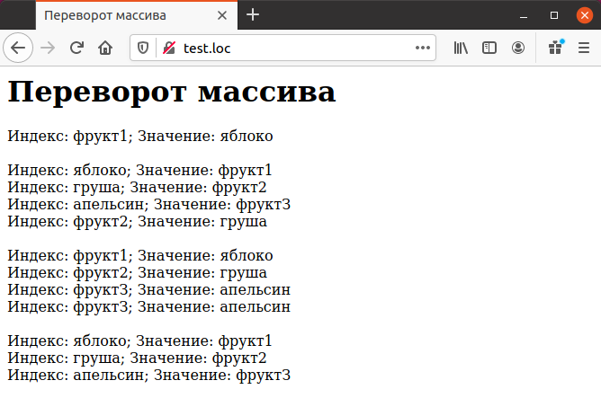

# Обработка данных в массивах

Данные в массивах могут бьпъ обработаны самыми различными способами,
Например, если требуется удалить в массиве элементы с повторяющимися 
значениями, на помощь приходит функция `array_unique()`:

```php
<?php
$scores = array (50, 60, 70, 65, 65) ;
print_r($scores);
$scores = array_unique ($scores);
print_r($scores);
?>
```

Ниже приведен результат выполнения этого примера — следует обратить
внимание на то, что дублирующиеся элементы удалены:

```php
Array
(
[0] => 65
[1] => 60
[2] => 70
[3] => 65
[4] => 65
)
Array
(
[0] => 65
[1] => 60
[2] => 70
)
```

Вот еще одна полезная функция для обработки данных — `array_sum()`, 
которая возвращает сумму всех элементов массива:

```php
<?php
$scores = array(50, 60, 70, 64, 66) ;
echo "Средний балл = ", array_sum($scores) / count($scores) ;
?>
```

В этом примере вычисляется средний балл экзаменационных оценок 
студентов:

`Средний балл = 65`

И последний пример обработки данных — функция `array_flip()` меняет 
местами индексы и значения элементов массива, как показано в примере.

```php
<HTML>
    <HEAD>
        <TITLE>Переворот массива</TITLE>
    </HEAD>
    <BODY><H1>Переворот массива</H1>
        <?php
        $local_fruits = array (
        "фрукт1" => "яблоко",
        "фрукт2" => "груша",
        "фруктЗ" => "апельсин");
        foreach ($local_fruits as $key => $value)
        {
        echo "Индекс: $key; Значение: $value<BR>";
        echo "<BR>";
        $local_fruits = array_flip($local_fruits);
        foreach ($local_fruits as $key => $value)
        {
        echo "Индекс: $key; Значение: $value<BR>";
        }
        }
        ?>
    </BODY>
</HTML>
```
Результат выполнения примера представлен ниже

