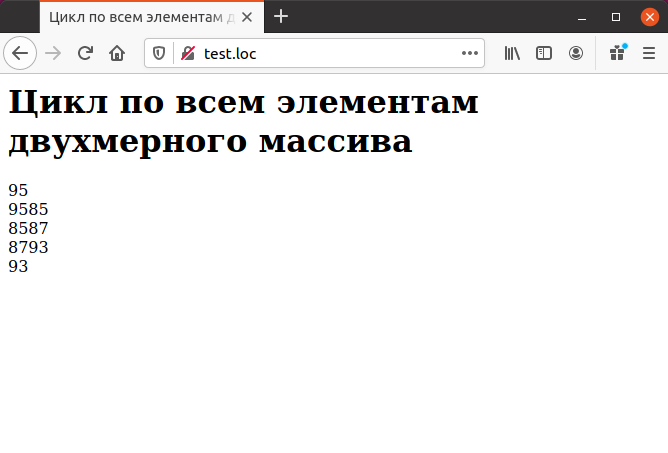

# Многомерные массивы


До сих пор рассматривались только одномерные массивы. Но в РНР имеется
возможность работы и с многомерными массивами. Пусть для хранения 
экзаменационных оценок используется одномерный массив `$testscores:`

```php
$testscores["Иванов"] = 95;
$testscores["Петров"] = 87;
```

Но что если надо хранить оценки по нескольким предметам? Для этого 
удобно использовать двухмерный массив, например:

```php
<?php
$testscores["Иванов"][1] = 95;
$testscores["Иванов"][2] = 85;
$testscores["Петров"][1] = 87;
$testscores["Петров"][2] = 93;
print_r($testscores);
?>
```

Элемент массива `$testscores["Иванов"][1]` содержит оценку Иванова
по первому предмету, `$testscores["Иванов"][2]` — по второму предмету
и т.д. В результате выполнения предыдущего примера будет выведен созданный
многомерный массив:

```php
Array
(
[Иванов] =>Array
(
[1] => 95
[2] => 85
)
[Петров] =>Array
(
)
[1] => 87
[2] => 93
)
```

Доступ к элементу многомерного массива осуществляется путем указания
всех его индексов, например:

```php
echo "Оценка Иванова по первому предмету : ", $testscores["Иванов"][1];
```

Если требуется заменить элемент массива его значением в строковой 
константе, ограниченной двойными кавычками, подобно тому, как это делается
с обычной переменной, следует заключить элемент массива в фигурные скобки
и использовать для строковых индексов одиночные кавычки:

```php
echo "Оценка Иванова по первому предмету : ", {$test_scores['Иванов'][1]};
```
Для создания многомерных массивов можно использовать и сокращенную
форму, но следует иметь в виду, что в данном случае нумерация второго индекса
начинается с 0:

```php
<?php
$testscores ["Иванов"] [] =95;
$testscores ["Иванов"] [] =85;
$testscores ["Петров"] [] =87;
$testscores ["Петров"] [] =93;
print_r( $testscores ) ;
?>
```


В РНР многомерные массивы можно рассматривать как массивы массивов.
Например, двухмерный массив можно рассматривать как одномерный массив,
элементами которого в свою очередь также являются одномерные массивы.
Пример такого описания приведен ниже:

```php
<?php
$test_scores = array("Иванов" => array(95, 85), "Петров" =>
array(87, 93) ) ;
print_r($test_scores);
?>
```

В результате будет создан следующий массив:

```php
Array
(
[Иванов] => Array
(
[0] =>95
[1] =>85
)
[Петров] => Array
(
[0] =>87
[1] =>93
)
)
```

Если требуется начать нумерацию второго индекса с 1, используется уже 
известный синтаксис:

```php
<?php
$testscores = array("Иванов" => array ("A" => 95, 85); 
"Петров" => array("A" => 87, 93));
print_r($testscores);
?>
```

В результате будет создан массив следующего вида:

```php
Array
(
[Иванов] => Array
(
[1]=>95
[2]=>85
)
[Петров] => Array
(
[1]=>87
[2]=>93
)
)
```


# Многомерные массивы и циклы

Часто возникает необходимость перебрать все элементы многомерного 
массива в цикле. Для этого используются вложенные циклы. Например, для случая
двухмерного массива внешний цикл перебирает первый индекс массива, а 
внутренний цикл перебирает второй индекс. Пример вложенных циклов приведен
ниже.

```php
<?php
$testscores [0] [] = 95;
$testscores [0] [] = 85;
$testscores [1] [] = 97;
$testscores [1] [] = 93;
for ($outer_index = 0; $outer_index < count($testscores); $outer_index++)
{
for ($inner_index = 0; $inner_index < count($testscores[$outer_index]); $inner_index++)
{
echo "\$testscores [$outer_index][$inner_index] = ",
$testscores[$outer_index][$inner_index] , "\n";
}
}
?>
```

В результате выполнения этого кода будет выведен весь исходный 
двухмерный массив:

```php
$testscores [О] [О] = 95
$testscores [О] [1] = 85
$testscores [1] [О] = 87
$testscores [1] [1] = 93
```

Для этой же цели могут использоваться циклы `foreach`, а для случая 
строковых индексов это наилучший способ, так как строковые индексы нельзя 
увеличивать оператором `++`. В примере ниже при каждом выполнении тела внешнего
цикла из исходного массива извлекается одномерный массив, соответствующий
значению счетчика цикла.

## Пример 

```php
<HTML>
    <HEAD>
        <TITLE>Цикл по всем элементам двухмерного массива</TITLE>
    </HEAD>
    <BODY>
        <H1>Цикл по всем элементам двухмерного массива</H1>    
        <?php
        $testscores ["Иванов"]["первый"] = 95;
        $testscores ["Иванов"]["второй"] = 85;
        $testscores [ "Петров"]["первый"] = 87;
        $testscores ["Петров"]["второй"] = 93;
        foreach ($testscores as $outer_key => $single_array)
        {          
            foreach($single_array as $inner_key => $value)
            {
                echo $testscores[$outer_key][$inner_key], "<BR>";
                echo $value;
            } 
        }
        ?>
    </BODY>
</HTML>
```

Результат выполнения

