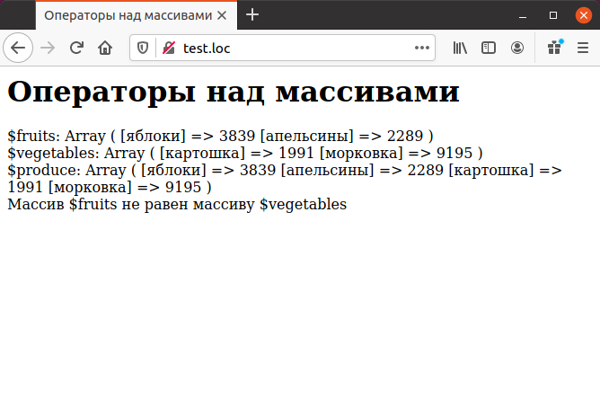

# Операторы над массивами

Кроме разнообразных функций, над массивами можно производить действия
при помощи следующих операторов:

```php
$а + $Ь Объединение массивов $а и $Ь.
$a = $b Тождественно равно TRUE, если $а и $Ь содержат одни и те же
элементы в том же самом порядке.
$а != $b Неравно TRUE, если массив $а не равен массиву $b.
$а <> $Ь Неравно TRUE, если массив $а не равен массиву $b.
```

Большинство операторов занимаются сравнением массивов, но оператор `+`
предназначен для их конкатенации. В примере показано использование 
операторов `+` и `==`.

Пример использования операторов

```php
<HTML>
    <HEAD>
        <TITLE>Операторы над массивами</TITLE
    </HEAD>
    <BODY><H1>Операторы над массивами</H1>
        <?php
        $fruits ["яблоки"] = 3839;
        $fruits ["апельсины"] = 2289;
        $vegetables ["картошка"] = 1991;
        $vegetables ["морковка"] = 9195;
        echo "\$fruits: ";
        print_r ($fruits);
        echo "<BR>";
        echo " \$vegetables: ";
        print_r($vegetables);
        echo "<BR>";
        $produce = $fruits + $vegetables;
        echo "\$produce: ";
        print_r ($produce);
        echo "<BR>";
        if ($fruits == $vegetables)
        {
            echo "Массив \$fruits равен массиву \$vegetables <BR>";
        }
        else
        {
            echo "Массив \$fruits не равен массиву \$vegetables<BR>";
        }
        ?>
    </BODY>
</HTML>
```

Результат выполнения примера.

