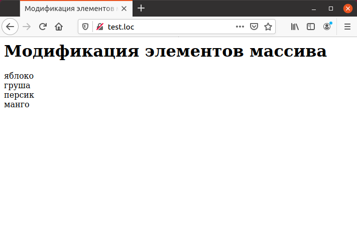

# 3.5 PHP Модификация элементов массива

После создания массивов нередко требуется изменение значений его 
элементов. Это выполняется так же просто, как и изменение значения переменной. Для
этого требуется обратиться к элементу массива по его индексу. Например, 
имеется следующий массив:

```php
$fruits[О] = "яблоко";
$fruits[1] = "груша";
$fruits[2] = "абрикос";
```

Для присваивания нового значения второму элементу массива используется
оператор:
`$fruits[2] = "персик";`
Для добавления нового элемента в конец массива используются уже 
знакомая конструкция:
`$fruits[] = "манго";`
Наконец, выведем на экран содержимое массива при помощи цикла. Все эти
операторы объединены в примере ниже.

**Пример. Модификация элементов массива.**

```php
<HTML>
  <HEAD>
  <TITLE>Модификация элементов массива</TITLE>
  </HEAD>
  <BODY>
    <H1>Модификация элементов массива</H1>
    <?php
        $fruits [0] = "яблоко";
        $fruits [1] = "груша";
        $fruits [2] = "абрикос";
        $fruits [2] = "персик";
        $fruits [] = "манго";
        for ($index = 0; $index < count($fruits); $index++){
            echo $fruits[$index], "<BR>";
        }
    ?>
  </B0DY>
</HTML>
```
На рисунке ниже представлен результат выполнения этого примера.



Предусмотрена также возможность скопировать массив целиком как одну
переменную:

```php
<?php
$fruits[О] = "яблоко";
$fruits[1] = "груша";
$fruits [2] = "абрикос";
$new_fruits = $fruits;
echo $new_fruits[2];
```

Пример кода, приведенный выше, выведет строку `"абрикос"`.