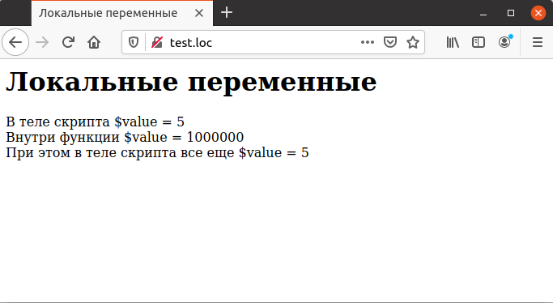

## 4.11 Локальные переменные
Как рассказывалось выше, областью действия переменной называется та часть кода, в которой сохраняется ее значение. Область действия приобретает важное значение при использовании функций. В скриптах, не содержащих функций, областью действия является весь скрипт целиком. Например, если переменная была один раз использована в начале скрипта, то ее значение будет сохраняться до конца скрипта или до тех пор, пока оно не будет изменено в результате другого оператора присваивания. В нижеследующем фрагменте кода оба раза речь идет об одной и той же переменной `$count`:
```php
<?php
   $count = 1;
   $count = 55;
?>
```
Если скрипт является достаточно длинным и разрабатывается продолжительное время, легко сделать ошибку и использовать одно и то же имя переменной для разных применений, что неминуемо приведет к конфликту при выполнении программы. Ошибки такого рода (особенно если совпадает тип использованных значений) обнаружить достаточно затруднительно.  
При использовании функций область действия всех переменных, описанных
внутри функции, ограничена этой функцией. Это позволяет использовать одни
и те же названия в разных функциях, не опасаясь того, что они начнут 
конфликтовать. Все локальные переменные уничтожаются при возврате управления
из функции.  
Пример 4.8 демонстрирует использование локальных переменных. В 
основном скрипте осуществляется присвоение значения переменной `$value`. Такое же присвоение осуществляется внутри функции `local_sсоре`, но на самом деле оно относится к другой, одноименной переменной. При выходе из функции ее локальная переменная исчезает, но переменная, описанная в основном скрипте, сохраняет свое первоначальное значение.  
Пример 4.8. Локальные переменные
```php
<HTML>
    <HEAD>
        <TITLE>
            Локальные переменные
        </TITLE>
    </HEAD>
    <BODY>
        <H1>
            Локальные переменные
        </H1>
        <?php
            function local_scope()
            {
                $value = 1000000;
                echo "Внутри функции \$value = ", $value,"<BR>";
            }
            $value = 5 ;
            echo "В теле скрипта \$value = ", $value, "<BR>";
            local_scope();
            echo "При этом в теле скрипта все еще \$value = " ,
            $value, "<BR>";        
        ?>
    </BODY>
</HTML>
```
Рис. 4.8 демонстрирует использование локальной переменной и сохранение значения переменной `$value` в основном скрипте.
  

Рис. 4.8. Использование локальной переменной