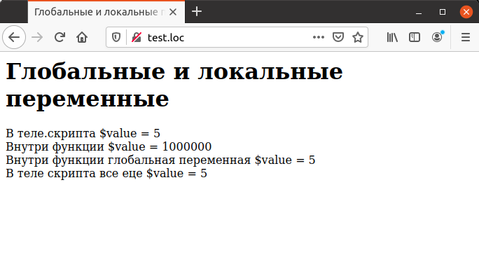

## 4.12 Глобальные переменные
Локальные переменные ограничены той функцией, в рамках которой они 
используются. При этом переменные, описанные в основном скрипте (они 
называются глобальными), для функции являются недоступными. В отличие от некоторых других языков программирования, в РНР такой доступ по умолчанию запрещен, чтобы избежать конфликтов локальных и глобальных данных. Чтобы получить доступ к глобальным переменным, должно использоваться их явное описание при помощи оператора  `global`. Пример 4.9 демонстрирует использование как локальных, так и глобальных переменных.
```php
<HTML>
    <HEAD>
        <TITLE>
            Глобальные и локальные переменные
        </TITLE>
    </HEAD>
    <BODY>
        <H1>
            Глобальные и локальные переменные
        </H1>
        <?php
            function local_scope ()
            {
                $value =1000000;
                echo "Внутри функции \$value = ", $value, "<BR>";
            }
            function global_scope ()
            {
                global $value;
                echo "Внутри функции глобальная переменная \$value =
                " , $value, "<BR>";
            }
            $value = 5;
            echo "В теле.скрипта \$value = ", $value, "<BR>";
            local_scope ();
            global_scope ();
            echo "В теле скрипта все еце \$value = ", $value, "<BR>";
        ?>
    </BODY>
</HTML>
```
Из примера 4.9 видно, что после использования оператора `global`значение переменной `$value` стало доступно внутри функции `global_scope`. Вместо использования оператора `global` доступ к глобальным переменным можно получить при помощи специального суперглобального массива `$GLOBALS`, как показано в следующем фрагменте кода:
```php
function global_scope ()
{
    echo "Внутри функции глобальная переменная \$value .= ",
    $GLOBALS ["value"], "<BR>";
}
```

*****  
Рис. 4.9. Использование глобальной переменной