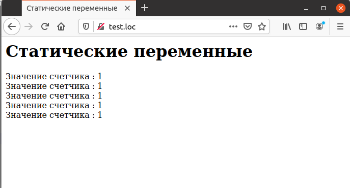
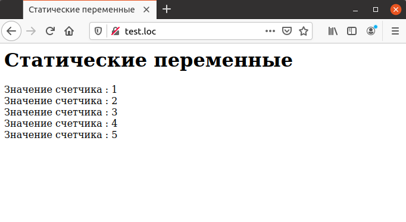

## 4.13 Статические переменные
Следует иметь в виду, что локальные переменные в функциях инициализируются при каждом ее запуске. Между вызовами функции значения локальных переменных не сохраняются. Это демонстрирует пример 4.10, в котором делается попытка использовать функцию `track_count` для увеличения значения внутреннего счетчика.
Пример 4.10. Попытка создания счетчика
```php
<HTML>
    <HEAD>
        <TITLE>
            Статические переменные
        </TITLE>
    </HEAD>
    <BODY>
        <H1>
            Статические переменные
        </H1>
        <?php
            function track_count ()
            {
                $counter = 0;
                $counter++;
                return $counter;
            }
            echo "Значение счетчика : ", track_count (), "<BR>";
            echo "Значение счетчика : ", track_count (), "<BR>";
            echo "Значение счетчика : ", track_count (), "<BR>";
            echo "Значение счетчика : ", track_count (), "<BR>";
            echo "Значение счетчика : ", track_count (), "<BR>";
        ?>
    </BODY>
</HTML>
```
Как видно из рис.4.10, попытка создания счетчика оказалась неудачной, так как значение переменной `$counter` теряется после каждого возврата из функции.

*****  
Рис. 4.10. Неработающий счетчик вызовов  

Для решения данной проблемы следует объявить переменную `$counter` как
статическую. Статические переменные сохраняют свое значение между 
вызовами функции. Как видно из примера 4.11, единственное ключевое слово `static` превращает неработоспособный код в работающее приложение.
```php
<HTML>
    <HEAD>
        <TITLE>
            Статические переменные
        </TITLE>
    </HEAD>
    <BODY>
        <H1>
            Статические переменные
        </H1>
        <?php
            function track_count ()
            {
                static $counter = 0;
                $counter++;
                return $counter;
            }
            echo "Значение счетчика : ", track_count (), "<BR>";
            echo "Значение счетчика : ", track_count (), "<BR>";
            echo "Значение счетчика : ", track_count (), "<BR>";
            echo "Значение счетчика : ", track_count (), "<BR>";
            echo "Значение счетчика : ", track_count (), "<BR>";
        ?>
    </BODY>
</HTML>
```
Рис. 4.11 демонстрирует, что теперь значение переменной `$counter` 
сохраняется между вызовами функции `track_count`.

*****  
Рис.4.11 Работоспособный счетчик вызовов
