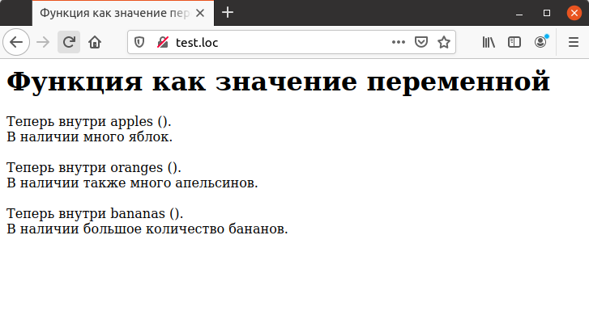

## 4.14 Переменные, ссылающиеся на функции
В РНР предусмотрена возможность использования переменных, ссылаю-
щихся на функции. Переменная может содержать имя функции, и функция,
имя которой содержится в переменной, может быть вызвана путем 
использования соответствующего синтаксиса. Подобным способом во время выполнения скрипта можно определять, какая именно функция будет вызвана.  

### Замечание
*****
В практике существует несколько причин, по которым требуется определять имя вызываемой функции во время выполнения скрипта. Например, это требуется при использовании т.н. `callback-функций`, которые вызываются изнутри другой функции при наступлении определенного события.Другим вариантом является создание таб-
лицы-селектора, которая содержит имена функций, вызываемых в зависимости от поступления тех или иных данных.
*****  
Пусть описана следующая функция:
```php
function apples ()
{
    echo "Теперь внутри apples ().<BR>";
    echo "В наличии много яблок. <BRxBR>" ;
}
```
Для вызова данной функции при помощи переменной следует присвоить ей
в качестве значения имя функции и потом использовать имя этой переменной как будто бы производится вызов функции:
```php
$function_variable = "apples";
$function_variable ();
```
Функциям, вызываемым при помощи данного способа, можно передавать 
аргументы, при этом можно также использовать значения аргументов по 
умолчанию, что и показано на примере 4.12.  

Пример 4.12. Функция как значение переменной
```php
</HEAD>
    <BODY>
        <H1>
            Функция как значение переменной
        </H1>
        <?php
            function apples ()
            {
                echo "Теперь внутри apples ().<BR>";
                echo "В наличии много яблок. <BR><BR>";
            }
            function oranges ($argument)
            {
                echo $argument ,"<BR>";
                echo "В наличии также много апельсинов. <BR><BR>";
            }
            function bananas ($argument= " ")
            {
                echo " $argument <BR>";
                echo "В наличии большое количество бананов. <BR><BR>" ;
            }
            $function_variable = "apples";
            $function_variable ();
            $function_variable = "oranges";
            $function_variable ("Теперь внутри oranges ().");
            $function_variable = "bananas";
            $function_variable ("Теперь внутри bananas ().");
        ?>
    </BODY>
</HTML>
```

