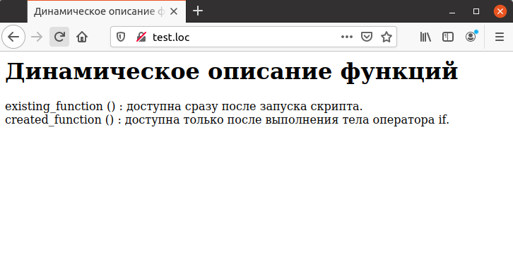

## 4.15 Условное описание функций
РНР является интерпретируемым языком, что, в частности, означает, что в том случае, если функция описывается в теле условного оператора `if`, она не будет доступна для вызова до тех пор, пока тело оператора не будет выполнено. Например, пусть функция описана следующим образом:
```php
if ($create_function)
{
    function created_function()
    {
        echo "created_function () : доступна только после выполнения
        тела оператора if.<BR>";
    }
}
```
В этом случае функция `created_function` будет доступна для вызова только после выполнения тела оператора `if`. Поэтому при необходимости использовать эту функцию далее, следует убедиться в ее наличии. В данном случае необходимо проверить значение переменной
```php
$create_function:
if (Screatefunction)
{
    created function ();
}
```
Пример 4.13 показывает использование условного описания функций.
```php
<HTML>
    <HEAD>
        <TITLE>
            Динамическое описание функций
        </TITLE>
    </HEAD>
    <BODY>
        <H1>
            Динамическое описание функций
        </H1>
        <?php
            function existing_function ()
            {
                echo "existing_function () : доступна сразу после 
                запуска скрипта.<BR>";
            }
            existing_function ( ) ;
            $create_function = TRUE;
            if ($create_function)
            {
                function created_function ()
                {
                    echo "created_function () : доступна только после 
                    выполнения тела оператора if.<BR>";
                }
            }
            if ($create_function)
            {
                created_function ();
            }
        ?>
    </BODY>
</HTML>
```
Результат выполнения примера показан на рис. 4.13

*****  
Рис. 4.13. Вызов функции, описанной условно