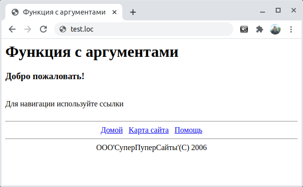

## 4.2 Передача данных в функцию
Функция может использовать данные, переданные ей при вызове. Для этого используется список аргументов функции, который представляет собой их перечисление через запятую:
```php
function function name ([largumentlist...])
{
    [statements;]
    [return return value;]
}
```
Это механизм работает следующим образом. Предположим, требуется 
дополнить панель навигации из предыдущего раздела некоторым текстом и сведениями об авторских правах (копирайтом). Этого можно достичь путем передачи в функцию двух аргументов. Пусть они называются `$name` и `Scopyright`, тогда строка описания функции будет выглядеть следующим образом:  

```php
function nav_bar ($text, $copyright)
{
    ...
}
```
После такого описания эти аргументы можно использовать в теле функции как простые переменные:
```php
function nav_bar ($text, $copyright)
```
```php
...
echo "<hr>";
echo "<FONT SIZE="1">$text</Ix/FONT>";
echo "<BRxF0NT SIZE= "1">$copyright</Ix/FONT>" ;
echo "</center>";
```
В примере 4.2 использован вызов модифицированной функции, которой в качестве аргументов передаются две строковых константы.
```php
<HTML>
    <HEAD>
        <TITLE>
            Функция с аргументами
        </TITLE>
    </HEAD>
    <BODY>
        <H1>
            Функция с аргументами
        </H1>
        <?php
            echo "<H3>Добро пожаловать!</H3>";
            echo "<br>";
            echo "Для навигации используйте ссылки";
            echo "<br>";
            echo "<br>";

            nav_bar("OOO'СуперПуперСайты'", "(С) 2006");

            function nav_bar ($text, $copyright)
            {
                echo "<hr>";
                echo "<center>";
                echo "<a href='home.html'>Домой</a>&nbsp;&nbsp;&nbsp;" ;
                echo "<a href='map.html'>Kapта сайта</a>&nbsp;&nbsp;&nbsp;";
                echo "<a href='help.html'>Помощь</a>";
                echo "<hr>";
                echo "<F0NT SIZE= '3' >$text</Ix/FONT>";
                echo "<BRxF0NT SIZE= '3' >$copyright</Ix/FONT> ";
                echo "</center>";
            }
        ?>
    </BODY>
</HTML>
```
*****  

На рис. 4.2 представлена улучшенная панель навигации.
