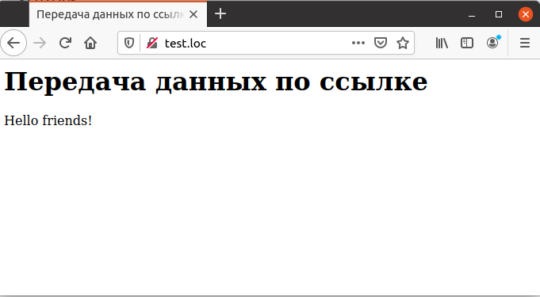

## 4.5 Передача аргумента по ссылке
Обычно передача аргумента функции осуществляется по значению. Это 
означает, что в функцию передается копия данных, а не сами данные. Если аргумент функции изменяется внутри тела функции, это не оказывает никакого влияния на значения переменных за ее пределами.
Зачастую возникает необходимость в том, чтобы функция могла возвращать
измененное значение переменной, переданной ей в качестве аргумента. К 
примеру, требуется разработать функцию, которая добавляет к переданной ей 
переменной строку и возвращает результат через ту же переменную. 
Соответствующий код должен был бы выглядеть следующим образом:
```php
<?php
function add_text(Stext)
{
    Stext .= "прекрасна";
}
$string = "Жизнь ";
add_text ($string);
echo $string;
?>
```
Но при запуске этого примера будет выведена только строка «Жизнь», так
как по умолчанию аргументы передаются по значению. Исправить эту ошибку
можно при помощи единственного символа, который определяет передачу 
аргумента функции *по ссылке*. Таким символом является амперсанд `(&)`:
```php
<?php
function add_text (&$ text)
{
    Stext .= "прекрасна";
}
Sstring = "Жизнь ";
addtext (Sstring);
echo Sstring;
?>
```
В данном примере в функцию передается ссылка на аргумент — переменную
`$string`. Это означает, что при обращении внутри функции к переменной
`$text` на самом деле происходит обращение к переменной `$string`. Таким 
образом, изменения, сделанные в теле функции, распространяются на данные 
основного скрипта. Это демонстрирует пример 4.4.
```php
<HTML>
    <HEAD>
        <TITLE>
            Передача данных по ссылке
        </TITLE>
    </HEAD>
    <BODY>
        <H1>
            Передача данных по ссылке
        </H1>
        <?php
            function add_text (&$text)
            {
                $text .= "friends!";
            }
            $string = "Hello ";
            add_text ($string);
            echo $string;
        ?>
    </BODY>
</HTML>
```

*****
<center>Рис. 4.4. Передача аргументов по ссылке</center>  

Как видно из рис. 4.4, значение переменной, переданной по ссылке, изменено внутри функции.   
При передаче данных по ссылке следует соблюдать осторожность, так как при неаккуратном использовании этой возможности можно внести в код программы трудно обнаружимую ошибку. Именно поэтому по умолчанию принята передача данных по значению.