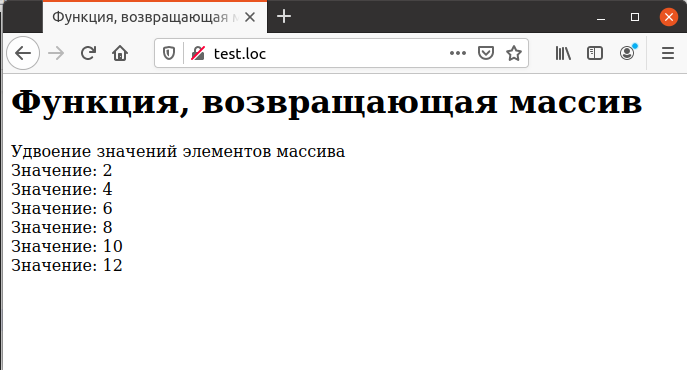

## 4.8 Функция, возвращающая массив
Функция может вернуть в качестве своего результата не только скалярное
значение, но и целый массив. Для этого используется тот же самый оператор
`return`, описанный в предыдущем разделе. Например, требуется разработать функцию, которая удваивает элементы массива, переданного ей в качестве единственного аргумента:
```php
function array_doubler ($arr)
{
    ...
}
```
В теле функции осуществляется циклическая обработка элементов массива,
которая состоит в том, что их значения удваиваются и помещаются на прежнее
место:
```php
function array_doubler ($arr)
{
    for ($loop_index =0; $loop_index < count ($arr);
    $loop_index++)
    {
        $arr [$loop_index] *= 2;
    }
    ...
}
```
Наконец, преобразованный массив возвращается как результат выполнения
функции:
```php
function array_doubler ($arr)
{
    for ($loop_index = 0; $loop_index < count ($arr);
    $loop_index++)
    {
        $arr [$loop_index] *= 2;
    }
    return $arr;
}
```
Пример 4.6. Функция, возвращающая массив
```php
<HTML>
    <HEAD>
        <TITLE>
            Функция, возвращающая массив
        </TITLE>
    </HEAD>
    <BODY>
        <H1>
            Функция, возвращающая массив
        </H1>
        <?php
            function array_doubler ($arr)
            {
                for ($loop_index = 0; $loop_index < count ($arr) ;
                $loop_index++)
                {
                    $arr [$loop_index] *= 2;
                }
                
                return $arr;
            }
            $array = array (1, 2, 3, 4, 5, 6);
            $array = array_doubler ($array);
            echo "Удвоение значений элементов массива<BR>";
            foreach ($array as $value)
            {
                echo "Значение: $value<BR>";
            }
        ?>
    </BODY>
</HTML>
```

Рис. 4.6. Удвоение элементов массива  
 
На рис. 4.6 представлен результат выполнения примера. В качестве 
исходного массива были взяты первые шесть натуральных чисел.