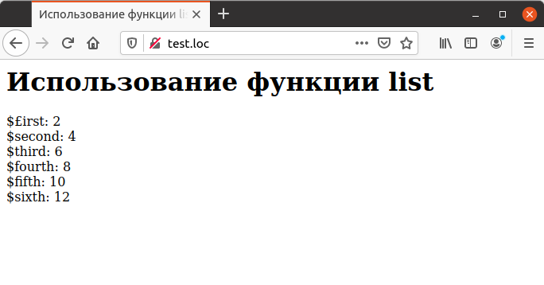

## 4.9 Использование списков
Использование функции, которая возвращает массив данных, является одним
из способов передачи нескольких значений из функции. Существует 
модификация этого способа, при котором используется списки переменных. Для описания списка переменных применяется системная функция list, осуществляющая присвоение перечисленным при ее вызове переменным значений элементов массива. Для демонстрации использования этой функции взята функция array_doubler из предыдущего раздела, которая удваивает значения 
элементов массива. Пусть требуется присвоить первые шесть элементов удвоенного массива переменным `$first`, `$second`, `$third`. д. Этого можно достичь при помощи конструкции следующего вида:
```php
list ($first, $second, $third, $fourth, $fifth, $sixth) =
array_doubler ($array);
```
Пример 4.7 демонстрирует использование данного способа. Таким образом
можно осуществить передачу из функции нескольких значений. Альтернативой служит передача аргумента по ссылке (см. соответствующий раздел выше).
```php
<HTML>
    <HEAD>
        <TITLE>
            Использование функции list
        </TITLE>
    </HEAD>
    <BODY>
        <H1>
            Использование функции list
        </H1>
        <?php
            function array_doubler ($arr)
            {
                for ($loop_index = 0; $loop_index < count ($arr);
                $loop_index++)
                {
                    $arr [$loop_index] *= 2;
                }
                return $arr;
            }
            $array = array (1, 2, 3, 4, 5, 6);
            list ($first, $second, $third, $fourth, $fifth, $sixth) =
            array_doubler ($array);
            echo "\$£irst: $first<BR>";
            echo "\$second: $second<BR>";
            echo "\$third: $third<BR>";
            echo "\$fourth: $fourth<BR>";
            echo "\$fifth: $fifth<BR>";
            echo "\$sixth: $sixth<BR>";           
        ?>
    </BODY>
</HTML>
```
Рис. 4.7 показывает, что значения переменным присвоены корректно.
  
*****  
Рис. 4.7. Использование списков

В том случае, если требуется использовать только первые три элемента 
массива для присвоения их значений переменным, соответствующий оператор 
выглядит следующим образом (лишние элементы массива, который возвращает
функция, просто игнорируются):
```php
list ($first, $second, $third) = array_doubler ($array);
echo "\$first: $first\n";
echo "\$second: $second\n";
echo "\$third: $third\n";
```
Следует обратить внимание на то, что использование функции list для 
формирования массива некорректно. Следующий фрагмент кода является 
ошибочным:
```php
return list ($arr[0], $агг[1], $arr[2], $arr[3], $arr[4], $arr[5]);
```