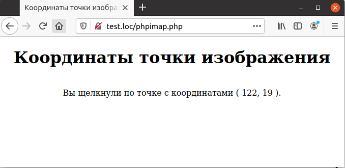

## 5.10 Кнопка-изображение
РНР также поддерживает кнопки-изображения, который представляют 
собой графические файлы, щелчок по каждой точке которого можно обработать особым образом. Для создания подобных элементов управления используется тег `<INРUT TYPE=IMAGE>`, атрибут `SRC` которого указывает на графический файл, что продемонстрировано в примере 5.15.  

Пример 5.15. Графическая кнопка-изображение, `phpimap.html`
```php
HTML>
    <HEAD>
        <TITLE>
            Кнопка-изображение
        </TITLE>
    </HEAD>
    <BODY>
        <CENTER>
            <H1>
                Кнопка-изображение
            </H1>
            <FORM METHOD="POST" ACTION="phpimap.php">
                Щелкните по картинке :
                <INPUT NAME="imap" TYPE="IMAGE" SRC="imap.BMP">
            </FORM>
        </CENTER>
    </BODY>
</HTML>
```  
Когда пользователь щелкает мышкой по картинке (см. рис. 5.15), координаты точки, где произведен щелчок, передаются в скрипт. Кнопке-изображению при помощи атрибута `NAME` присвоено имя `imap`, и в большинстве языков программирования координаты точки именовались бы как `imap.x` и `imap.y`.
Но так как подобный синтаксис недопустим в РНР, эти имена автоматически заменяются на допустимые - `imap_x` и `imap_y`, что и показано в примере 5.16.  

Пример 5.16. Определение координат щелчка, phpimap.php
```php
<HTML>
    <HEAD>
        <TITLE>
            Координаты точки изображения
        </TITLE>
    </HEAD>
    <BODY>
        <CENTER>
            <H1>Координаты точки изображения</H1>
            <BR>
            Вы щелкнули по точке с координатами (
            <?php
                echo $_REQUEST["imap_x"], ", ", $_REQUEST["imap_y"];
            ?>
            ).
        </CENTER>
    </BODY>
</HTML>
```  

*****
Рис. 5.15. Кнопка-изображение

Результат выполнения примера приведен на рис. 5.16. После определения координат можно произвести их анализ и предпринять соответствующие действия. 

  

Рис. 5.16. Отображение координат щелчка

