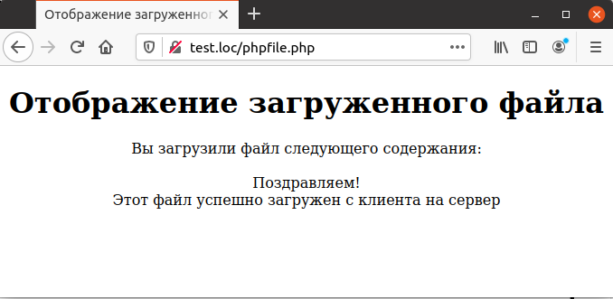

## 5.12 Обработка загруженного файла
Доступ к загруженным файлам осуществляется по имени (в примере 5.17 задано имя `userfile`). Но при этом не используется описанные выше массивы [$_GET](https://www.php.net/manual/ru/reserved.variables.get.php), [$_POST](https://www.php.net/manual/ru/reserved.variables.post.php) и [$_REQUEST](https://www.php.net/manual/ru/reserved.variables.request.php). Для обработки файлов предназначен специальный суперглобальный массив [$_FILES](https://www.php.net/manual/ru/reserved.variables.files.php). Данный массив является двухмерным, при этом первым индексом является имя поля для загрузки файла. Второй индекс массива принимает фиксированный набор значений, все его возможные варианты представлены ниже:
<table border="1" width="100%" cellpadding="1">
      <tr>
        <td ><center>$_FILES [userfile] ['name' ]</center></td>
        <td><center>Имя исходного файла на компьютере
пользователя.</center></td>
      </tr>
      <tr>
        <td width="150"><center>$_FILES [userfile]['type']</center></td>
        <td><center>MIME-тип файла. Например, для 
текстовых файлов это «text/plain», а для 
графических изображений может быть
«image/gif».</center></td>
      </tr>
      <tr>
        <td ><center>$_FILES [userfile]['size']</center></td>
        <td><center>Размер загруженного файла в байтах
или 0, если пользователь не выбрал файл
для загрузки.</center></td>
      </tr>
      <tr>
        <td ><center>$_FILES [userfile]['tmp_name']</center></td>
        <td><center>Имя временного файла, куда был 
загружен файл с компьютера пользователя
или пустая строка, если пользователь не
выбрал файл для загрузки.</center></td>
      </tr>
      <tr>
        <td ><center>$_FILES [userfile]['error']</center></td>
        <td><center>Код ошибки, возникшей при загрузке
файла. Значение 0 говорит об отсутствии
ошибки. Элемент присутствует, начиная
СРНР4.2.0.</center></td>
      </tr>
</table>    

## Замечание  
*****
Массив $_FILES введен, начинаясРНР4.1.0. До этой версии использовался глобальный массив $HTTP_POST_FILES, который внутри функций требует обязательного объявления при помощи оператора global. Начиная с РНР6.0, этот массив не используется.
*****  
После успешной загрузки содержимое файла сохраняется в каталоге для 
временных файлов, а имя этого временного файла помещается в элемент массива $_FILES ['userfile']['tmp_name'] (считаем, что поле для загрузки файла называется userfile). В примере 5.18 показано отображение загруженного файла на экране. Перед тем, как прочесть содержимое файла, его необходимо открыть при помощи функции [`fopen`](https://www.php.net/manual/ru/function.fopen.php). Она имеет два параметра — имя файла и строку, которая задает режим открытия. В данном случае файл открывается для чтения, поэтому строка режима выглядит как «г»:
```php
$handle = fopen ($_FILES ['userfile']['tmp_name'] , "r" ) ;
```  
Далее используется цикл `whiIe`, который повторяется до тех пор, пока не будет достигнут конец файла (этот факт определяется при помощи функции [`feof`](https://www.php.net/manual/ru/function.feof.php)).  
`while (!feof ($handle))...`  
Для чтения очередной строки файла используется функция [`fgets`](https://www.php.net/manual/ru/function.fgets.php):  
`$text = fgets (Shandle)`;  
Наконец, после завершения вывода файла его следует закрыть при помощи
функции [`fclose`](https://www.php.net/manual/ru/function.fclose.php). Хотя после завершения выполнения любого скрипта все 
принадлежащие ему ресурсы, в том числе и файлы, автоматически освобождаются, рекомендуется закрывать файлы явно.  

Пример 5.18. Отображение загруженного файла, phpfile.php
```php
<HTML>
    <HEAD>
        <TITLE>
            Отображение загруженного файла
        </TITLE>
    </HEAD>
    <BODY>
        <CENTER>
            <H1>Отображение загруженного файла</H1>
            Вы загрузили файл следующего содержания:
            <BR> 
            <?php
                $handle = fopen ($_FILES ['userfile']['tmp_name'], 'r');
                while (!feof ($handle))
                {
                    $text = fgets ($handle);
                    echo $text, "<BR>";
                }
                fclose ($handle);
            ?>
        </CENTER>
    </BODY>
</HTML>
```  

Рис. 5.18. Отображение загруженного файла

