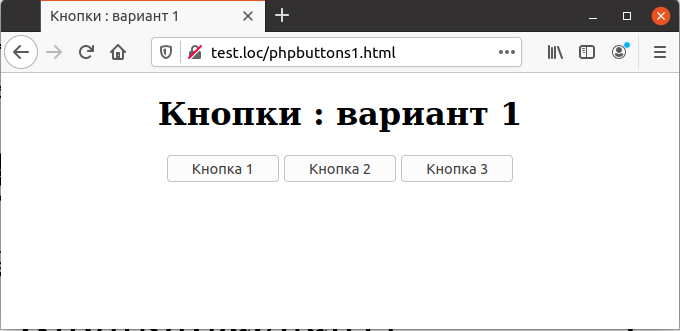
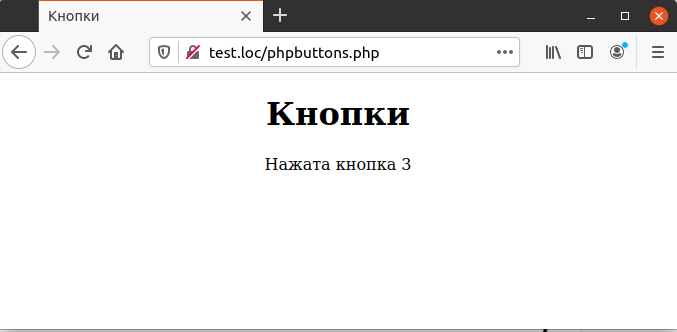

## 5.13 Кнопки  
Кнопки часто используются на HTML-страницах. Кнопки отличаются от остальных элементов управления тем, что они не остаются нажатыми после щелчка по ним. Поэтому в тот момент, когда данные посылаются скрипту-обработчику, кнопка уже давным-давно находится в отжатом состоянии. Как же определить, какая именно кнопка была нажата? Для этого можно использовать различные способы, и три из них приведены в этой главе.  
Одним из возможных
вариантов является комбинированное использование PHP, JavaScript и скрытого поля, как показано в примере 5.19. Когда пользователь щелкает по кнопке, функция JavaScript сохраняет соответствующую кнопке строку в скрытом поле и затем использует функцию [`submit`](https://learn.javascript.ru/forms-submit) для отправки результатов на web-сервер
скрипту phpbuttons.php.  
## Кнопки: вариант 1
  
Пример 5.19. Страница с тремя кнопками (вариант 1), phpbuttons1.html
```php
<HTML>
    <HEAD>
        <TITLE>
            Кнопки : вариант 1
        </TITLE>
    </HEAD>
    <BODY>
        <CENTER>
            <H1>
                Кнопки : вариант 1
            </H1>
            <FORM NAME="form1" METHOD="POST" ACTION="phpbuttons1.php">
                <INPUT TYPE="HIDDEN" NAME="Button">
                <INPUT TYPE="BUTTON" VALUE="Кнопка 1" ONCLICK="buttonl ()">
                <INPUT TYPE="BUTTON" VALUE="Кнопка 2" 0NCLICK="button2 ()">
                <INPUT TYPE="BUTTON" VALUE="Кнопка 3" 0NCLICK="button3 ()">  
            </FORM>
            <SCRIPT LANGUAGE="JavaScript">
                <!
                function button1 ()
                {
                    document.form1.Button.value = "кнопка 1"
                    forml.submit ()
                    }
                function button2 ()
                {
                    document.form1.Button.value = "кнопка 2"
                    forml.submit ()
                }
                function button3 ()
                {
                    document.form1.Button.value = "кнопка 3"
                    forml.submit ()
                }
                // ->
            </SCRIPT>
        </CENTER>
    </BODY>
</HTML> 
```  

На рис. 5.19 представлен внешний вид рассмотренной формы с тремя 
кнопками.
  

Рис. 5.19. Страница с тремя кнопками : вариант 1  

Для определения того, какая кнопка нажата, следует всего лишь прочесть содержимое скрытого поля Button, как показано в примере 5.20. Результат выполнения скрипта в случае, если пользователь щелкнул по третьей кнопке, приведен на рис. 5.20.  

Пример 5.20. Отображение загруженного файла, phpbuttons1.html
```php
<HTML>
    <HEAD>
        <TITLE>
            Кнопки
        </TITLE>
    </HEAD>
    <BODY>
        <CENTER>
            <H1>Кнопки</H1>
            Нажата 
            <?php
                if (isset($_REQUEST["Button"])){
                    echo $_REQUEST["Button"], "<BR>";
                }
            ?>
        </CENTER>
    </BODY>
</HTML>
```

  

Рис. 5.20. Отображение нажатой кнопки

## Кнопки:вариант 2
В предыдущем разделе для определения нажатой кнопки использовался
JavaScript. Но того же результата можно достигнуть, если использовать кнопку отправки вместо обычной кнопки. Для этого требуется три web-формы вместо nодной, каждая со своей отдельной кнопкой отправки. Для определения того, какая из трех кнопок нажата, в каждой форме используется скрытое поле с одним
и тем же именем Button, но с различными значениями в этих трех формах.  
Это продемонстрировано на примере 5.21. Интересно, что скрипт-обработчик при этом не меняется — он точно так же анализирует одно и то же поле с одним и тем же именем. То, что это поле описано в различных формах, неважно — скрипт всегда обрабатывает данные только той формы, в которой была нажата
кнопка отправки.  

Пример 5.21. Страница с тремя кнопками (вариант 2),
phpbuttons2.html  

```php
<HTML>
    <HEAD>
        <TITLE>
            Кнопки : вариант 2
        </TITLE>
    </HEAD>
    <BODY>
        <CENTER>
            <H1>
                Кнопки : вариант 2
            </H1>
            <FORM NAME="form1" ACTION="phpbuttons.php" METHOD="POST">
                <INPUT TYPE="HIDDEN" NAME="Button" VALUE="кнопка 1">
                <INPUT TYPE="SUBMIT" VALUE="Кнопка 1">
            </FORM>
            <FORM NAME="form2" ACTION="phpbuttons.php" METHOD="POST">
                <INPUT TYPE="HIDDEN" NAME="Button" VALUE="кнопка 2">
                <INPUT TYPE="SUBMIT" VALUE="Кнопка 2">
            </FORM>
            <FORM NAME="form3" ACTION="phpbuttons.php" METHOD="POST">
                <INPUT TYPE="HIDDEN" NAME="Button" VALUE="кнопка 3">
                <INPUT TYPE="SUBMIT" VALUE="Кнопка 3">
            </FORM>

        </CENTER>
    </BODY>
</HTML>  
```  

Внешний вид страницы приведен на рис. 5.21. Она практически ничем не 
отличается от рис. 5.19, за исключением того, что кнопки расположены по вертикали, а не по горизонтали.  
  
Рис. 5.21. Страница с тремя кнопками: вариант 2  

Обработчик данной формы полностью идентичен тому, который приведен
в предыдущем разделе в примере 5.20 (см. также рис. 5.20).  

## Кнопки:вариант 3
В предыдущем разделе для идентификации нажатой кнопки 
использовались скрытые поля, но на самом деле можно обойтись без них вовсе. При помощи атрибута "VALUE" имеется возможность передать данные о кнопке PHP-скрипту, что делает использование скрытых полей ненужным.
Для этого каждой кнопке отправки присваивается одно и то же имя Button (ранее это имя использовалось для скрытого поля).  
При этом при помощи атрибута "VALUE каждой кнопке присваивается уникальное значение, по которому они и будут различаться. Код страницы, созданной по этой схеме, приведен в примере 5.22, а внешний вид — на рис. 5.22. Обработчик данной страницы полностью идентичен двум предыдущим (см. пример 5.20) и рис.5.20.  
Пример 5.22. Страница с тремя кнопками (вариант 3), phpbuttons3.html  

```php
<HTML>
    <HEAD>
        <meta http-equiv="content-type" content="text/html; charset=utf-8" />
        <TITLE>
            Кнопки : вариант 3
        </TITLE>
    </HEAD>
    <BODY>
        <CENTER>
            <H1>
                Кнопки : вариант 3
            </H1>
            <FORM NAME="form1" ACTION="phpbuttons.php" METHOD="POST">
                <INPUT TYPE="SUBMIT" NAME="Button" VALUE="кнопка 1">
            </FORM>
            <FORM NAME="form2" ACTION="phpbuttons.php" METHOD="POST">
                <INPUT TYPE="SUBMIT" NAME="Button" VALUE="кнопка 2">
            </FORM>
            <FORM NAME="form3" ACTION="phpbuttons.php" METHOD="POST">
                <INPUT TYPE="SUBMIT" NAME="Button" VALUE="кнопка 3">
            </FORM>
        </CENTER>
    </BODY>
</HTML> 
```  

  
Рис. 5.22. Страница с тремя кнопками: вариант 3
