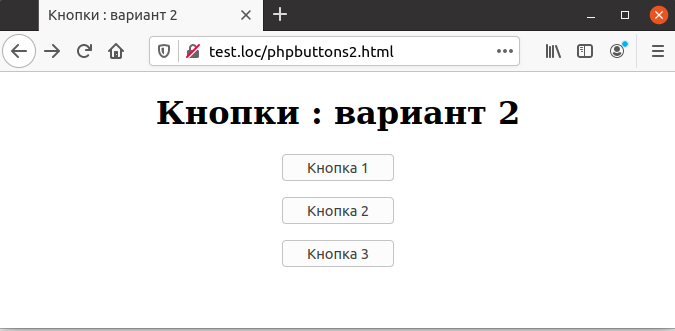

## 5.14 Кнопки:вариант 2
В предыдущем разделе для определения нажатой кнопки использовался
JavaScript. Но того же результата можно достигнуть, если использовать кнопку отправки вместо обычной кнопки. Для этого требуется три web-формы вместо nодной, каждая со своей отдельной кнопкой отправки. Для определения того, какая из трех кнопок нажата, в каждой форме используется скрытое поле с одним
и тем же именем Button, но с различными значениями в этих трех формах.  
Это продемонстрировано на примере 5.21. Интересно, что скрипт-обработчик при этом не меняется — он точно так же анализирует одно и то же поле с одним и тем же именем. То, что это поле описано в различных формах, неважно — скрипт всегда обрабатывает данные только той формы, в которой была нажата
кнопка отправки.  

Пример 5.21. Страница с тремя кнопками (вариант 2),
phpbuttons2.html  

```php
<HTML>
    <HEAD>
        <TITLE>
            Кнопки : вариант 2
        </TITLE>
    </HEAD>
    <BODY>
        <CENTER>
            <H1>
                Кнопки : вариант 2
            </H1>
            <FORM NAME="form1" ACTION="phpbuttons.php" METHOD="POST">
                <INPUT TYPE="HIDDEN" NAME="Button" VALUE="кнопка 1">
                <INPUT TYPE="SUBMIT" VALUE="Кнопка 1">
            </FORM>
            <FORM NAME="form2" ACTION="phpbuttons.php" METHOD="POST">
                <INPUT TYPE="HIDDEN" NAME="Button" VALUE="кнопка 2">
                <INPUT TYPE="SUBMIT" VALUE="Кнопка 2">
            </FORM>
            <FORM NAME="form3" ACTION="phpbuttons.php" METHOD="POST">
                <INPUT TYPE="HIDDEN" NAME="Button" VALUE="кнопка 3">
                <INPUT TYPE="SUBMIT" VALUE="Кнопка 3">
            </FORM>

        </CENTER>
    </BODY>
</HTML>  
```  

Внешний вид страницы приведен на рис. 5.21. Она практически ничем не 
отличается от [рис. 5.19](5.13_knopki-variant-1.md), за исключением того, что кнопки расположены по 
вертикали, а не по горизонтали.  
  
Рис. 5.21. Страница с тремя кнопками: вариант 2  

Обработчик данной формы полностью идентичен тому, который приведен
в предыдущем разделе в примере 5.20 (см. также [рис. 5.20](5.13_knopki-variant-1.md)).  
