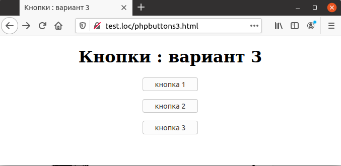

## 5.15 Кнопки:вариант 3
В предыдущем разделе для идентификации нажатой кнопки 
использовались скрытые поля, но на самом деле можно обойтись без них вовсе. При помощи атрибута "VALUE" имеется возможность передать данные о кнопке PHP-скрипту, что делает использование скрытых полей ненужным.  
Для этого каждой кнопке отправки присваивается одно и то же имя Button (ранее это имя использовалось для скрытого поля). При этом при помощи атрибута "VALUE каждой кнопке присваивается уникальное значение, по которому они и будут различаться. Код страницы, созданной по этой схеме, приведен в примере 5.22, а внешний вид — на рис. 5.22. Обработчик данной страницы полностью идентичен двум предыдущим (см. [пример 5.20](5.13_knopki-variant-1.md) и [рис.5.20](5.13_knopki-variant-1.md)).  
Пример 5.22. Страница с тремя кнопками (вариант 3), phpbuttons3.html  

```php
<HTML>
    <HEAD>
        <meta http-equiv="content-type" content="text/html; charset=utf-8" />
        <TITLE>
            Кнопки : вариант 3
        </TITLE>
    </HEAD>
    <BODY>
        <CENTER>
            <H1>
                Кнопки : вариант 3
            </H1>
            <FORM NAME="form1" ACTION="phpbuttons.php" METHOD="POST">
                <INPUT TYPE="SUBMIT" NAME="Button" VALUE="кнопка 1">
            </FORM>
            <FORM NAME="form2" ACTION="phpbuttons.php" METHOD="POST">
                <INPUT TYPE="SUBMIT" NAME="Button" VALUE="кнопка 2">
            </FORM>
            <FORM NAME="form3" ACTION="phpbuttons.php" METHOD="POST">
                <INPUT TYPE="SUBMIT" NAME="Button" VALUE="кнопка 3">
            </FORM>
        </CENTER>
    </BODY>
</HTML> 
```  

  
Рис. 5.22. Страница с тремя кнопками: вариант 3