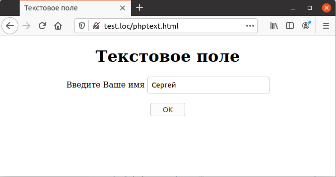

## 5.2 Текстовые поля
Текстовые поля предназначены для ввода однострочных данных в 
web-формах и являются наиболее часто употребительными элементами управления. Для создания текстового поля используется тег `<INPUT TYPE='TEXT'>` внутри тera `<F0RM>`.  
Ниже в примере используются два файла — HTML-страница, на которой
пользователь может ввести данные, и PHP-скрипт, которые их отображает.
В HTML-странице содержится форма с текстовым полем, которая направляет данные скрипту `phptext.php`.  
В примере 5.1 пользователь вводит собственное имя, для чего используется текстовое поле с именем «Name». Имя поля задается при помощи атрибута `NAME` и присваивается для того, чтобы к данным, введенным в этом поле, можно было бы обратиться в РНР-скрипте.  
Пример 5.1. Описание текстового поля, phptext.html
```php  
<HTML>
    <HEAD>
        <TITLE>
            Текстовое поле
        </TITLE>
    </HEAD>
    <BODY>
        <CENTER>
            <H1>
                Текстовое поле
            </H1>
            <FORM METHOD="POST" ACTION="phptext.php">
                Введите Ваше имя
                <INPUT NAME="Name" TYPE="TEXT">
                <BR><BR>
                <INPUT TYPE=SUBMIT VALUE="OK">
            </FORM>
        </CENTER>
    </BODY>
</HTML>
```
*****
При загрузке данного файла на экране будет отображено текстовое поле для ввода имени пользователя и кнопка «ОК» для завершения ввода данных, как показано на рис. 5.1
  

Рис. 5.1. Пример использования текстового поля —
запрос имени пользователя  

После того как пользователь ввел имя и нажал кнопку «ОК», производится загрузка РНР-скрипта, указанного в атрибуте `ACTION`, и данные передаются ему для обработки. В следующем разделе рассказывается, как получить доступ к этим данным.