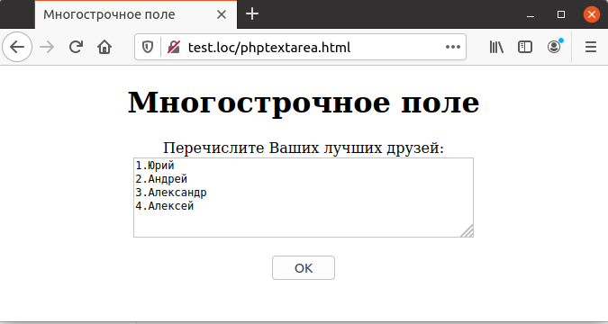
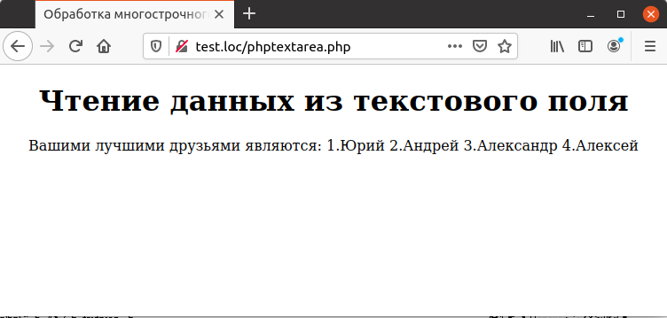

## 5.4 Многострочные поля
Многострочные поля предназначены для ввода большого количества текста. Для их описания используется тег `<TEХTAREA>`, в атрибутах которого задается размер области для ввода текста по вертикали в строках (атрибут `ROWS`) и по горизонтали в символах (атрибут `COLS`).  
В остальном работа с ними практически
аналогична использованию текстовых полей, что и продемонстрировано в примере 5.3.  
Пример 5.3. Описание многострочного поля, phptextarea.html
```php
<HTML>
    <HEAD>
        <meta http-equiv="content-type" content="text/html; charset=utf-8" />
        <TITLE>
            Многострочнoе полe
        </TITLE>
    </HEAD>
    <BODY>
        <CENTER>
            <H1>
                Многострочнoе полe
            </H1>
            <FORM METHOD="POST" ACTION="phptextarea.php">
                Перечислите Ваших лучших друзей:
                <BR>
                <TEXTAREA NAME="Friends" COLS="50" ROWS="5">
1.
2.
3.
4.
                </TEXTAREA>
                <BR>
                <BR>               
                <INPUT TYPE=SUBMIT VALUE="OK">
            </F0RM>
        </CENTER>
    </BODY>
</HTML>
```
Следует обратить внимание на то, что в отличие от простого текстового поля, начальное значение многострочного поля содержится внутри тега `<TEXTAREA>`, что видно на рис. 5.3.
  

Для получения данных, введенных в многострочном поле, используется тот же массив [`$_REQUEST`](https://www.php.net/manual/ru/reserved.variables.request), что и в предыщущем разделе, как показано в примере 5.4.  

Пример 5.4. Обработка многострочного поля, phptextarea.php
```php
<HTML>
    <HEAD>
        <TITLE>
            Обработка многострочного поля,
        </TITLE>
    </HEAD>
    <BODY>
        <CENTER>
            <H1>Чтение данных из текстового поля</H1>
            Вашими лучшими друзьями являются:
            <?php
                echo $_REQUEST["Friends"];
            ?>
        </CENTER>
    </BODY>
</HTML>
```
Результат выполнения этого примера представлен на рис. 5.4. Следует обратить внимание, что несмотря на то, что данные были введены в несколько строк, браузер при формировании страницы отформатировал их в одну строку.  
Для того чтобы расположить данные на экране также, как они были введены пользователем, следовало бы заменить при выводе символ "`\n`" (перевод строки) на тег `<BR>` (разрыв строки).  


