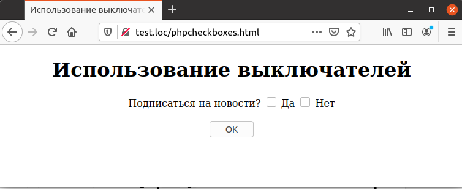
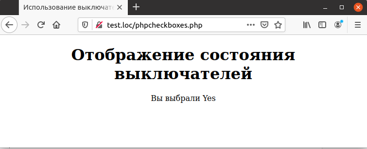

## 5.5 Выключатели (checkboxes)
Еще одним основным элементом управления в HTML-формах является 
выключатель (checkbox). Для его описания используется тег `<INPUT
ТУРЕ=СНЕСКB0Х>`. В примере 5.5 он используется для того, чтобы получить от пользователя ответ на заданный вопрос.  

Пример 5.5. Описание выключателей в форме, phpcheckboxes.html
```php
<HTML>
    <HEAD>
        <TITLE>
            Использование выключателей
        </TITLE>
    </HEAD>
    <BODY>
        <CENTER>
            <H1>
                Использование выключателей
            </H1>
            <FORM METHOD="POST" ACTION="phpcheckboxes.php">
                Подписаться на новости?
                <INPUT NAME="Check1" TYPE="CHECKBOX" VALUE="Yes"> Да
                <INPUT NAME="Check2" TYPE="CHECKBOX" VALUE="No"> Нет
                <BR><BR>
                <INPUT TYPE=SUBMIT VALUE="OK">
            </F0RM>
        </CENTER>
    </BODY>
</HTML>
```  
Рис. 5.5. Использование выключателей


*****
В данном примере пользователь может одновременно включить оба выключателя, дав оба ответа на вопрос. Для предотвращения возможности такого ввода можно использовать скрипт на стороне клиента, например `JavaScript`, что выходит за рамки данной книги. Альтернативой является использование переключателей, как показано в следующем разделе. Можно также производить проверку данных на корректность в PHP-скрипте на стороне сервера, о чем рассказывается в главе 6. — Прим. ред.
*****
Для определения состояния выключателей в скрипте используются 
выражения `$_REQUEST ["Check1"]` и `$_REQUEST ["Check2"]` соответственно.  

Пример 5.6. Отображение состояния выключателей, phpcheckboxes.php
```php
<HTML>
    <HEAD>
        <TITLE>
            Использование выключателей
        </TITLE>
    </HEAD>
    <BODY>
        <CENTER>
            <H1>Отображение состояния выключателей</H1>
            Вы выбрали
            <?php
                if (isset($_REQUEST ["Check1"]))
                    echo $_REQUEST ["Check1"], "<BR>";
                if (isset($_REQUEST ["Check2"]))
                    echo $_REQUEST ["Check2"], "<BR>";
            ?>
        </CENTER>
    </BODY>
</HTML>
``` 
Тонкость заключается в том, что если выключатель включен, то соответствующий ему элемент массива принимает значение, определенное в атрибуте `VALUE` тега `INPUT`, в данном случае «Yes» и «No» соответственно. Если же он выключен, то значение соответствующего элемента массива не определено, и использование его вызовет предупреждение.  
Для проверки, существует ли заданный элемент массива, может использоваться функция [`isset`](https://www.php.net/manual/ru/function.isset). Функция возвращает `TRUE`, если переменная или элемент массива, заданный ей в качестве параметра, существует, и `FALSE` в противоположном случае.  

Как видно из рис. 5.6, состояние выключателей отображаются корректно.
