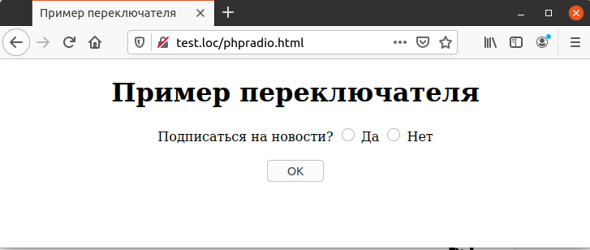
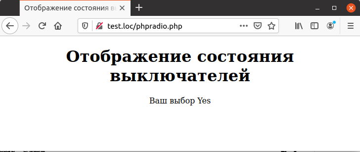

## 5.6 Переключатели (radio buttons)
В предыдущем примере пользователь может одновременно отметить оба 
варианта ответа на вопрос, что в общем случае недопустимо. В таком случае можно использовать переключатели1, который позволяют выбрать только один вариант из некоторого фиксированного множества альтернатив. Переключатель описывается при помощи набора тегов `<INРUT TYРE=RADIO>`, а для группировки различных альтернатив все они связываются при помощи атрибута `NAME`, значение которого должно быть одинаково внутри группы.   
Пример 5.7. Описание переключателя, phpradio.html
```php
<HTML>
    <HEAD>
        <TITLE>
            Пример переключателя
        </TITLE>
    </HEAD>
    <BODY>
        <CENTER>
            <H1>
                Пример переключателя
            </H1>
            <FORM METHOD="POST" ACTION="phpradio.php">
                Подписаться на новости?
                <INPUT NAME="Radio1" TYPE="RADIO" VALUE="Yes"> Да
                <INPUT NAME="Radio1" TYPE="RADIO" VALUE="No"> Нет
                <BR><BR>
                <INPUT TYPE=SUBMIT VALUE="OK">
            </F0RM>
        </CENTER>
    </BODY>
</HTML>
```  
На рис. 5.7 виден переключатель на две позиции.
  

Для получения состояния переключателя используется одно обращение к 
соответствующему элементу массива [`$_REQUEST`](https://www.php.net/manual/ru/reserved.variables.request), как показано в примере 5.8.
Следует обратить внимание на то, что если пользователь не сделал никакого 
выбора, то соответствующий элемент массива `$_REQUEST` будет не определен, 
поэтому и в этом случае рекомендуется использовать функцию [`isset`](https://www.php.net/manual/ru/function.isset.php).  

Пример 5.8. Отображение состояния переключателя, phpradio.php
```php
<HTML>
    <HEAD>
        <TITLE>
            Отображение состояния выключателей
        </TITLE>
    </HEAD>
    <BODY>
        <CENTER>
            <H1>Отображение состояния выключателей</H1>
            <?php
                if (isset($_REQUEST ["Radio1"]))
                {
                    echo "Ваш выбор ", $_REQUEST ["Radio1"];
                }
                else
                {
                    echo "Выбор не произведен";
                }
            ?>
        </CENTER>
    </BODY>
</HTML>
```  

Рис. 5.8. Отображение состояния переключателя  

Если в одной форме требуется использовать несколько переключателей,
то для их идентификации каждой из групп тегов  `<INРUT TYPE=RADIO>` 
необходимо присвоить при помощи атрибута `NAМЕ` свое уникальное имя, которое и будет именем переключателя.