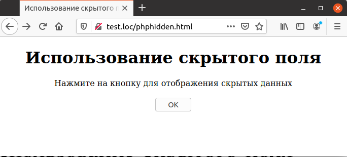
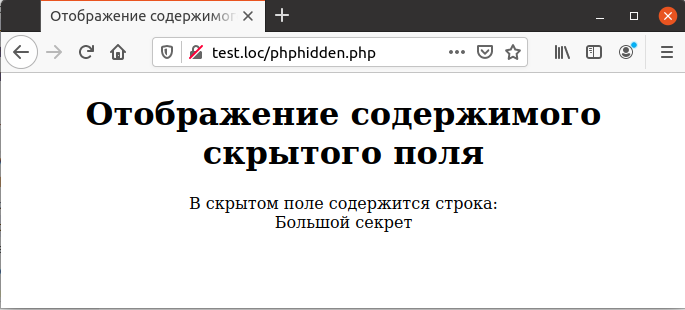

## 5.8 Скрытые поля
Еще одним элементом управления являются скрытые поля, которые 
позволяют сохранять в формах служебные данные. Это может быть удобно, 
например, в тех случаях, когда не разрешено использование `cookies`, а требуется сохранить какие-либо сведения о текущем сеансе работы пользователя.    
Пример 5.11. Использование скрытого поля, phphidden.html
```php
<HTML>
    <HEAD>
        <TITLE>
            Использование скрытого поля
        </TITLE>
    </HEAD>
    <BODY>
        <CENTER>
            <H1>
                Использование скрытого поля
            </H1>
            <FORM METHOD="POST" ACTION="phphidden.php">
                Нажмите на кнопку для отображения скрытых данных
                <INPUT NAME="Hidden" TYPE="HIDDEN" VALUE="Большой секрет">
                <BR>
                <BR>
                <INPUT TYPE=SUBMIT VALUE="OK">
            </FORM>
        </CENTER>
    </BODY>
</HTML>
```
  

Рис. 5.11. Отображение выбранных элементов списка  

Внешний вид этой страницы представлен на рис. 5.11. Данные, расположенные в скрытом поле, естественно, не отображаются на экране, но при нажатии на кнопку запускается скрипт, который способен отобразить их.
Содержимое скрытого поля может быть получено уже описанным выше 
способом — как элемент одного из массивов [$_GET](https://www.php.net/manual/ru/reserved.variables.get), [$_POST](https://www.php.net/manual/ru/reserved.variables.post.php) или [$_REQUEST](https://www.php.net/manual/ru/reserved.variables.request).
Это продемонстрировано на примере 5.12.   

Пример 5.12. Отображение содержимого скрытого поля, phphidden.php
```php
<HTML>
    <HEAD>
        <TITLE>
            Отображение содержимого скрытого поля
        </TITLE>
    </HEAD>
    <BODY>
        <CENTER>
            <H1>Отображение содержимого скрытого поля</H1>
            В скрытом поле содержится строка:
            <BR>
            <?php
                echo $_REQUEST["Hidden"];
            ?>
        </CENTER>
    </BODY>
</HTML>
```
  

Рис. 5.12. Отображение содержимого скрытого поля