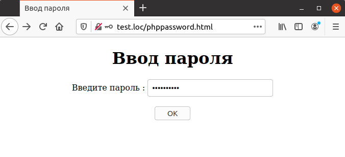
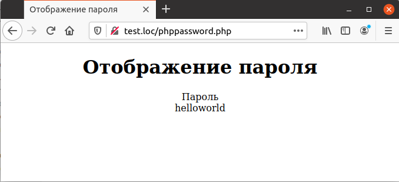

## 5.9 Поля для паролей
При вводе паролей и иных конфиденциальных данных нежелательно, чтобы
вводимый текст отображался на экране. Для этого предназначены поля для 
ввода паролей. В HTML-форме они описываются при помощи тега `<INРUT
TYPE=PASSWORD>`. С точки зрения РНР между ними и простыми текстовыми 
полями нет никакого различия, но при вводе данных в такие поля вместо 
вводимых символов отображаются звездочки. В примере 5.13 описывается поле для
пароля с именем «Password».  
Пример 5.13. Запрос пароля у пользователя, phppassword. html
```php
<HTML>
    <HEAD>
        <TITLE>
            Ввод пароля
        </TITLE>
    </HEAD>
    <BODY>
        <CENTER>
            <H1>
                Ввод пароля
            </H1>
            <FORM METHOD="POST" ACTION="phppassword.php">
                Введите пароль :
                <INPUT NAME="Password" TYPE="PASSWORD">
                <BR>
                <BR>
                <INPUT TYPE=SUBMIT VALUE="OK">
            </FORM>
        </CENTER>
    </BODY>
</HTML>
```  
Пример формы с уже введенным паролем приведен на рис. 5.13.

*****
Рис. 5.13. Ввод пароля  

Для того чтобы прочитать введенный пароль в скрипте, используется все тот же массив [`$ REQUEST`](https://www.php.net/manual/ru/reserved.variables.request.php), что показано на примере 5.14.  
Пример 5.14. Чтение введенного пароля, phppassword.php
```php
<HTML>
    <HEAD>
        <TITLE>
            Отображение пароля
        </TITLE>
    </HEAD>
    <BODY>
        <CENTER>
            <H1>Отображение пароля</H1>
            Пароль
            <BR>
            <?php
                echo $_REQUEST["Password"];
            ?>
        </CENTER>
    </BODY>
</HTML>
```
Результат выполнения этого примера показан на рис. 5.14. Конечно, в реальном приложении вместо того, чтобы показывать введенный пароль на экране, его следует сравнить с значением, хранящимся в закрытом списке, например, для того, чтобы предотвратить несанкционированный доступ к данным.  

Рис. 5.14. Отображение введенного пароля-