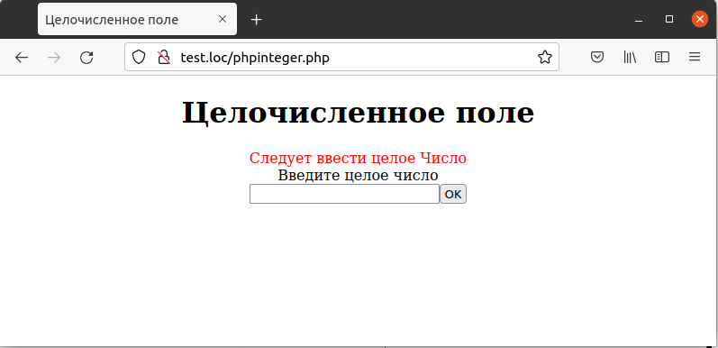

## 6.10 Проверка числовых полей  
Часто требуется проверить, что в поле введено целое или вещественное число,а не просто строка. Одним из наиболее простых способов является преобразование строки в число (при помощи функции [intval](https://www.php.net/manual/ru/function.intval.php) или [floatval](https://www.php.net/manual/ru/function.floatval.php) для целых или вещественных чисел соответственно) и затем обратно в строку, а затем сравнение исходной и полученной двойным преобразованием строки.    
Если они совпадают, то исходная строка содержит корректное число1. Для сравнения строк можно использовать функцию [strcmp](https://www.php.net/manual/ru/function.strcmp.php), которая возвращает ненулевое значение, если заданные ей как параметры строки различны. Ниже в примере 6.11
приведена подобная проверка для целых чисел.  
Пример 6.11. Поле,обязательное для ввода, phpinteger.php  
```php

<HTML>
    <HEAD>
        <TITLE>
            Целочисленное поле
        </TITLE>
    </HEAD>
    <BODY>
        <CENTER>
            <H1>Целочисленное поле</H1>
            <?php 
                $errors = array();
                if (isset ($_REQUEST["seen_already"]))
                {
                    validate_data();
                    if (count($errors) > 0)
                    {
                        display_errors();
                        display_form();
                    }
                    else
                    {
                        process_data();
                    }
                }
                else
                {
                    display_form();
                }
                function validate_data()
                {
                    global $errors;
                    if (strcmp($_REQUEST["Number"], strval(intval
                        ($_REQUEST["Number"]))))
                    {
                        $errors[] = "<FONT COLOR='RED'>Следует ввести целое
                        Число</FONT>";
                    }
                }   
                function display_errors()
                {
                    global $errors;
                    foreach ($errors as $err)
                    {
                        echo $err, "<BR>";
                    }
                }
                function process_data()
                {
                    echo "Целое число равно ".$_REQUEST["Number"];
                }
                function display_form()
                {
                    echo "<FORM METHOD='POST' ACTION='phpinteger.php'>";
                    echo "Введите целое число";
                    echo "<BR>";
                    echo "<INPUT NAME='Number' TYPE='TEXT'>";
                    echo "<BRxBR>";
                    echo "<INPUT TYPE=SUBMIT VALUE='OK'>";
                    echo "<INPUT TYPE=HIDDEN NAME='seen_already'
                    VALUE= 'data'>";
                    echo "</FORM>";
                }
            ?>
        </CENTER>
    </BODY>
</HTML>
```  
Если пользователь ввел некорректное число, то будет отображено соответствующее сообщение об ошибке, как на рис.6.11.  
  

Рис.6.11. Целоe число не введено