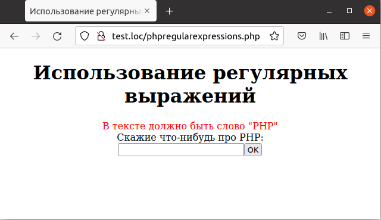

## 6.11 Проверка строковых полей  
Нередко возникает задача проверить текстовое поле на соответствие определенным критериям. Например, требуется проверить, содержит ли заданное текстовое поле слово «РНР». В РНР имеется мощный механизм [*регулярных выражений*](https://ru.wikipedia.org/wiki/%D0%A0%D0%B5%D0%B3%D1%83%D0%BB%D1%8F%D1%80%D0%BD%D1%8B%D0%B5_%D0%B2%D1%8B%D1%80%D0%B0%D0%B6%D0%B5%D0%BD%D0%B8%D1%8F), который позволяет решать подобные задачи. Полный обзор регулярных выражений выходит за рамки данной книги (дополнительную информацию можно получить, например, по адресу [www.php.net/manual/ru/ref.pcre.php](https://www.php.net/manual/ru/ref.pcre.php)). 
Данную же задачу можно решить при помощи регулярного выражения '/php/i'.
Для этого используется функция [preg_match](https://www.php.net/manual/ru/function.preg-match.php), как показано в примере 6.12.  
Пример 6.12. Проверка строкового поля при помощи
регулярного выражения, phpregularexpressions.php  
```php
<HTML>
    <HEAD>
        <TITLE>
            Использование регулярных выражений
        </TITLE>
    </HEAD>
    <BODY>
        <CENTER>
            <H1>Использование регулярных выражений</H1>
            <?php 
                $errors = array();
                if (isset ($_REQUEST["seen_already"]))
                {
                    validate_data();
                    if (count($errors) > 0)
                    {
                        display_errors();
                        display_form();
                    }
                    else
                    {
                        process_data();
                    }
                }
                else
                {
                    display_form();
                }
                function validate_data()
                {
                    global $errors;
                    if (!preg_match(' /php/i', $_REQUEST["Text"]))
                    {
                        $errors[] = "<FONT COLOR='RED'>B тексте должно быть
                        слово \"PHP\"</FONT>";
                    }
                }   
                function display_errors()
                {
                    global $errors;
                    foreach ($errors as $err)
                    {
                        echo $err, "<BR>";
                    }
                }
                function process_data()
                {
                    echo "Вы сказали:".$_REQUEST ["Text"];
                }
                function display_form()
                {
                    echo "<FORM METHOD='POST' ACTION='phpregularexpressions.php'>";
                    echo "Скажие что-нибудь про РНР:";
                    echo "<BR>";
                    echo "<INPUT NAME='Text' TYPE='TEXT'>";
                    echo "<BRxBR>";
                    echo "<INPUT TYPE=SUBMIT VALUE='OK'>";
                    echo "<INPUT TYPE=HIDDEN NAME='seen_already'
                    VALUE= 'data'>";
                    echo "</FORM>";
                }
            ?>
        </CENTER>
    </BODY>
</HTML>
```  
Если пользователь ввел строку, не содержащую слово «РНР», то будет 
отображено соответствующее сообщение об ошибке, как на рис. 6.12.  

