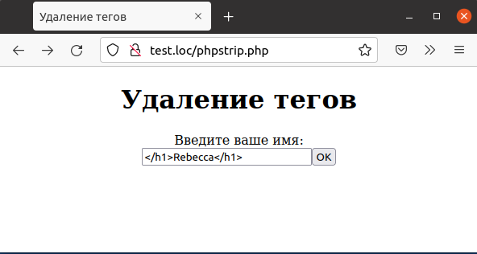
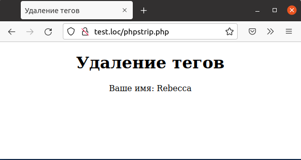

## 6.12 Удаление тегов HTML  
При обработке введенного текста необходимо обратить внимание на 
следующую деталь, в особенности, если строку потом планируется отображать.  
Пользователь может использовать при наборе текста теги HTML (в том числе и выражения на [JavaScript](https://ru.wikipedia.org/wiki/JavaScript)) что может повлиять на корректность работы приложения при использовании этого текста для формирования страницы.  
Для предотвращения этой ситуации можно использовать функцию [strip_tag](https://www.php.net/manual/ru/function.strip-tags.php), которая удаляет из заданной строки все теги, что и продемонстрировано в примере 6.13.  

Пример 6.13. Удаление тегов из введенного текста, phpstrip.php  
```php
<HTML>
    <HEAD>
        <TITLE>
            Удаление тегов
        </TITLE>
    </HEAD>
    <BODY>
        <CENTER>
            <H1>Удаление тегов</H1>
            <?php 
                $errors = array();
                if (isset ($_REQUEST["seen_already"]))
                {
                    validate_data();
                    if (count($errors) > 0)
                    {
                        display_errors();
                        display_form();
                    }
                    else
                    {
                        process_data();
                    }
                }
                else
                {
                    display_form();
                }
                function validate_data()
                {
                    global $errors;
                    if($_REQUEST["Name"] == "")
                    {
                        $errors[] = "<FONT COLOR='RED'>Имя обязательно для ввода</FONT>";
                    }
                }   
                function display_errors()
                {
                    global $errors;
                    foreach ($errors as $err)
                    {
                        echo $err, "<BR>";
                    }
                }
                function process_data()
                {
                    echo "Ваше имя: ";
                    $ok_text = strip_tags($_REQUEST["Name"]);
                    echo $ok_text;
                }
                function display_form()
                {
                    echo "<FORM METHOD='POST' ACTION='phpstrip.php'>";
                    echo "Введите ваше имя:";
                    echo "<BR>";
                    echo "<INPUT NAME='Name' TYPE='TEXT'>";
                    echo "<BRxBR>";
                    echo "<INPUT TYPE=SUBMIT VALUE='OK'>";
                    echo "<INPUT TYPE=HIDDEN NAME='seen_already'
                    VALUE= 'data'>";
                    echo "</FORM>";
                }
            ?>
        </CENTER>
    </BODY>
</HTML>
```  
Теперь, если пользователь введет текст, содержащий HTML-теги (как
на рис. 6.13), то при формировании страницы теги будут удалены, и 
потенциальная угроза безопасности приложения будет устранена (см. рис. 6.14).  

  
Рис.6.13. Попытка ввода HTML-тегов    
  
  
Рис.6.14. Текст отображается без тегов  
