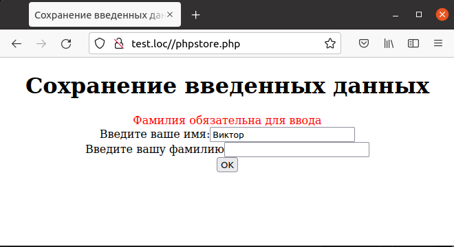

## 6.14 Сохранение данных
Если форма для ввода данных содержит несколько полей, а ошибку пользователь допустил при заполнении только некоторых из них, разумно сохранить корректные данные при повторном выводе формы, чтобы пользователю не пришлось бы вводить верные данные заново.  
Этот подход продемонстрирован в примере 6.15, который содержит форму из двух полей, обязательных для ввода.
Если пользователь заполнит только одно поле из двух, то при нажатии кнопки «ОК» будет сформировано соответствующее сообщение об ошибке, но уже введенное значение сохранится, и пользователю не придется набирать его повторно.  

Пример 6.15. Сохранение введенных данных,phprestore.php
```php
<HTML>
    <HEAD>
        <TITLE>
            Сохранение введенных данных
        </TITLE>
    </HEAD>
    <BODY>
        <CENTER>
            <H1>Сохранение введенных данных</H1>
            <?php 
                $errors = array();
                if (isset ($_REQUEST["seen_already"]))
                {
                    validate_data();
                    if (count($errors) > 0)
                    {
                        display_errors();
                        display_form();
                    }
                    else
                    {
                        process_data();
                    }
                }
                else
                {
                    display_form();
                }
                function validate_data()
                {
                    global $errors;
                    if($_REQUEST["FirstName"] == "")
                    {
                        $errors[] = "<FONT COLOR='RED'>Имя обязательно для ввода</FONT>";
                    }
                    if($_REQUEST["LastName"] == "")
                    {
                        $errors[] = "<FONT COLOR='RED'>Фамилия обязательна для ввода</FONT>";
                    }
                }   
                function display_errors()
                {
                    global $errors;
                    foreach($errors as $err)
                    {
                        echo $err, "<BR>";
                    }
                }
                function process_data()
                {
                    echo "Ваше имя: ";
                    echo $_REQUEST["FirstName"];
                    echo "<BR>Ваша фамилия: ";
                    echo $_REQUEST["LastName"];
                }
                function display_form()
                {   $first_name = isset($_REQUEST["FirstName"]) ?
                    $_REQUEST["FirstName"] : "" ;
                    $last_name = isset($_REQUEST["LastName"]) ?
                    $_REQUEST["LastName"] : "";
                    echo "<FORM METHOD='POST' ACTION='phpstore.php'>";
                    echo "Введите ваше имя:";
                    echo "<INPUT NAME='FirstName' TYPE='TEXT' VALUE='",
                    $first_name,"'>";
                    echo "<BR>";
                    echo "Введите вашу фамилию";
                    echo "<INPUT NAME='LastName' TYPE='TEXT' VALUE='",
                    $last_name,"'>";
                    echo "<BR>";
                    echo "<INPUT TYPE=SUBMIT VALUE='OK'>";
                    echo "<INPUT TYPE=HIDDEN NAME='seen_already'
                    VALUE='data'>";
                    echo "</FORM>";
                }
            ?>
        </CENTER>
    </BODY>
</HTML>
```
На рис.6.17 приведен пример результата выполнения этого скрипта в том
случае,если пользователь не ввел фамилию.Видно,что введенное имя сохранилось в форме.  

  

Рис.6.17.Сохранение данных в форме в случае ошибок ввода  
