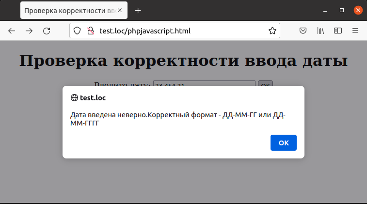

## 6.14 Использование JavaScript для проверки данных 
Наряду с РНР, который производит проверку данных на стороне сервера,можно также использовать JavaScript, при помощи которого данные могут быть проверены на стороне клиента.  
Использование JavaScript уменьшает нагрузку на сервер, а также сокращает трафик. Данный раздел не относится к РНР,но для полноты охвата темы он включен в книгу. В то же время, если пользователь отключил использование JavaScript, всегда можно использовать проверку на стороне сервера.  
К примеру, требуется проверить корректность ввода даты, которая может
быть представлена в одном из двух форматов — «ДД-ММ-ГГ» или
«ДД-ММ-ГГГГ». Если дата введена неверно, выводится сообщение об ошибке, и отправка данных формы блокируется. Для проверки даты написана функция на JavaScript под названием checker, которая вызывается непосредственно перед отправкой данных на сервер.  
  
Пример 6.16. Проверка корректности ввода даты при
помощи JavaScript, phpjavascript.html
```php
<HTML>
    <HEAD>
        <TITLE>
            Проверка корректности ввода даты
        </TITLE>
        <script>
            function checker()
            {
                var regExp1 = /\d{1,2}-\d{1,2}-\d{2}$/
                var regExp2 = /(\d{1,2})-(\d{1,2})-(\d{4})$/
                var result1 = document.form1.date1.value.match(regExp1)
                var result2 = document.form1.date1.value.match(regExp2)
                if (result1 == null && result2 == null) {
                    alert("Дата введена неверно.Корректный формат - ДД-ММ-ГГ или ДД-ММ-ГГГГ")
                    document.form1.date1.value = ""
                    return false
                } 
                else {
                    document.form1.submit()
                }
            }
        </script>
    </HEAD>     
    <BODY>
        <CENTER>
            <H1>Проверка корректности ввода даты</H1>
            <FORM NAME="form1" ACTION="somepage.php" METHOD="POST"
            onsubmit="return checker()" >
                Введите дату:
                <INPUT TYPE="TEXT" NAME="date1">
                <INPUT TYPE="SUBMIT" VALUE="OK">
            </FORM> 
        </CENTER>
    </BODY>
</HTML>
```  
Пример ввода некорректной даты приведен на рис.6.18. Как видно, при нажатии на кнопку «ОК» отображается сообщение об ошибке.  
  
Рис.6.18.Введена дата в неверном формате