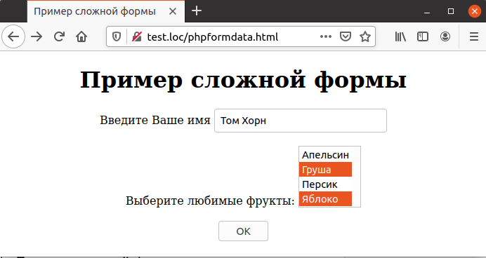
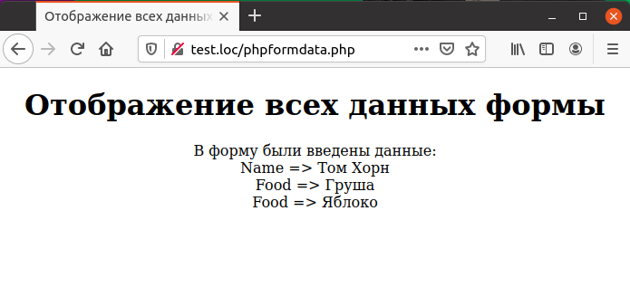

# 6 Web-приложения
В предыдущей главе описывались различные элементы управления, 
используемые в HTML-формах: текстовые поля, списки, выключатели и т.п. Эта глава
посвящена вопросу разработки web-приложений, которые получают данные,
введенные пользователем в форму, проверяют их на корректность и 
обрабатывают их определенным образом.  
 В этой главе рассказывается, как определить используемый тип браузера,как выполнять проверку различных типов данных, как перенаправить пользователя на различные [`URL`](https://developer.mozilla.org/ru/docs/Learn/Common_questions/What_is_a_URL), как разместить все web-приложение в одной форме и многое другое.
Ниже рассматривается структура типичного web-приложения.  
  Функция validate_data выполняет проверку всех введенных данных (например, являются ли строки, введенные в поля, предназначенные для ввода чисел, действительно числами). При обнаружении ошибок функция заносит их в глобальный массив $еггогs. Если проверка выявила ошибки, то их перечень выводится при помощи функции display_errors, а функция display_form выводит форму с полями, которые содержат уже введенные пользователем значения. Если же проверка данных прошла успешно, они обрабатываются при помощи функции process_data.
```php
validate_data () ;
if (count ($errors) > 0)
{
  display_errors () ;
  display_form ();
}
else
{
  process data ();
}
```
Проверка данных на корректность и предоставление пользователю 
возможности исправить допущенные ошибки является значительной и весьма важной частью любого web-приложения.  
# 6.1 Отображение данных формы  
В предыдущей главе уже рассматривался вопрос отображения данных, 
введенных в отдельные элементы управления. Для целей отладки web-приложения
полезен скрипт, который может отобразить все введенные в форму данные. При
разработке сложной формы можно легко допустить ошибку в названии элемента управления или присвоить двум элементам идентичное название, и такой
скрипт поможет выявить подобные ошибки. В примере 6.1 приведена форма, 
содержащая несколько различных элементов управления. Внешний вид формы
изображен на рис. 6.1.  
Пример 6.1. Пример сложной формы, phpformdata.html

```php
    <HTML>
        <HEAD>
            <TITLE>
                Пример сложной формы
            </TITLE>
        </HEAD>
        <BODY>
            <CENTER>
                <H1>
                    Пример сложной формы
                </H1>
                <FORM METHOD="POST" ACTION="phpformdata.php">
                    Введите Ваше имя
                    <INPUT NAME="Name" TYPE="TEXT" >
                    <BR>
                    <BR>
                    Выберите любимые фрукты:
                    <SELECT NAME="Food[]" MULTIPLE>
                        <OPTION value=Апельсин>Апельсин</OPTION>
                        <OPTION value=Гpушa>Груша</OPTION>
                        <OPTION value=Персик>Персик</OPTION>
                        <OPTION value=Яблоко>Яблоко</OPTION>
                    </SELECT>
                    <BR>
                    <BR>                
                    <INPUT TYPE=SUBMIT VALUE="OK">
                </FORM>
            </CENTER>
        </BODY>
    </HTML>  
```  
Для отображения всех данных, введенных в форме, используется цикл [`foreach`](https://www.php.net/manual/ru/control-structures.foreach.php) по всем элементам массива [`$_REQUEST`](https://www.php.net/manual/ru/reserved.variables.request.php). Если какой-либо элемент массива сам является массивом (это может случиться в случае использования списков с множественным выбором), используется вложеный цикл [`foreach`](https://www.php.net/manual/ru/control-structures.foreach.php).
Скрипт-обработчик формы приведен в примере 6.2, результат его 
выполнения — на рис. 6.2.  
  
Отображение данных формы  

  

Рис. 6.1. Пример сложной формы  

Пример 6.2. Отображение всех данных формы,
phpformdata.php  
```php
<HTML>
    <HEAD>
        <TITLE>
            Oтображение всех данных формы
        </TITLE>
    </HEAD>
    <BODY>
        <CENTER>
            <H1>
                Oтображение всех данных формы
            </H1>
            В форму были введены данные:
            <BR>
            <?php
                foreach ($_REQUEST as $key => $value)
                {
                    if (is_array ($value))
                    {
                        foreach ($value as $item)
                        {
                            echo $key, " => ", $item, "<BR>" ;
                        }
                    }
                    else
                    {
                        echo $key, " => ", $value,"<BR>" ;
                    }
                }
            ?>
        </CENTER>
    </BODY>
</HTML>
```  
  
Рис. 6.2. Отображение всех данных формы