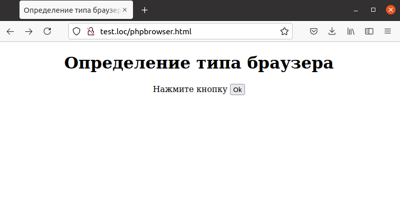
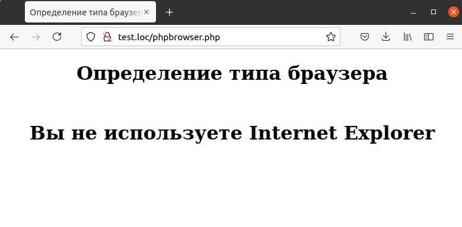

## 6.4 Определение типа браузера  
При разработке web-приложений очень важно иметь представление о той среде, в которой оно будет функционировать. А эта среда включает в себя браузер, который отвечает за отображение информации на экране компьютера. Различные браузера отличаются между собой по функциональности; например, Internet Explorer поддерживает [тег <marquее>](http://htmlbook.ru/html/marquee), а другие браузеры — нет. Поэтому если нет уверенности, что клиент использует именно браузер Internet Explorer, то не стоит использовать этот тег при построении HTML-страниц. Для определения типа браузера можно использовать элемент массива [$_SERVER['HTTP_USER_AGENT']](https://www.php.net/manual/ru/tutorial.useful.php). Например, если значение этого элемента содержит строку 'MSIE' (что проверяется при помощи функции [strpos](https://www.php.net/manual/ru/function.strpos.php)),то используется Internet Explorer. Подобная проверка продемонстрирована в примере 6.3  

Пример 6.3. Описание простой формы с одной кнопкой,
phpbrowser.html  
```php
<HTML>
    <HEAD>
        <TITLE>
            Определение типа браузера
        </TITLE>
    </HEAD>
    <BODY>
        <CENTER>
            <H1>
                Определение типа браузера
            </H1>
            <FORM METHOD="POST" ACTION="phpbrowser.php">>
                Нажмите кнопку
                <INPUT NAME="Name" TYPE="TEXT">
            </FORM>
        </CENTER>
    </BODY>
</HTML>
```  
На рис. 6.3 представлен внешний вид простой формы с кнопкой, после нажатия на которую загружается РНР-скрипт. В скрипте (пример 6.4) производится проверка на тип браузера. В случае Internet Explorer используется тег <marquее>, в противном случае — стандартный тег <Н1>.  
  
Рис. 6.3. Определение типа браузера  

Пример 6.4. Определение типа браузера, phpbrowser.php  
```php
<HTML>
    <HEAD>
        <TITLE>
            Oпределение типа браузера
        </TITLE>
    </HEAD>
    <BODY>
        <CENTER>
            <H1>
               Oпределение типа браузера
            </H1>
           <?php
                if (strpos ($_SERVER ["HTTP_USER_AGENT"], "MSIE"))
                {
                    echo ("<MARQUEExH1>Bы используете Internet
                    Explorer</H1x/MARQUEE>");
                }
                else
                {   
                    echo ("<CENTERxH1>Bы используете не Internet
                    Explorer</H1x/CENTER>");
                }
            ?>
        </CENTER>
    </BODY>
</HTML>
``` 
  
Рис. 6.4. Не используется Microsoft Internet Explorer 
