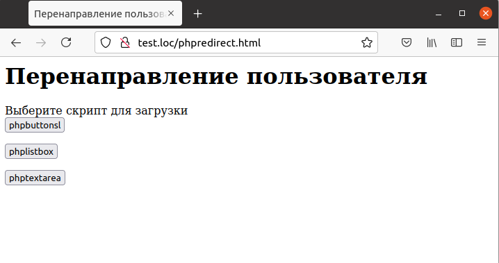

## 6.4 Перенаправление   

Наряду с чтением [HTTP-заголовков](https://developer.mozilla.org/ru/docs/Web/HTTP/Headers) имеется возможность формировать свои собственные заголовки. Одним из наиболее используемых заголовков является
[«Location»](https://ru.wikipedia.org/wiki/HTTP_location), который осуществляет перенаправление браузера на указанную страницу.  
Для создания заголовка используется функция header. В частности, для создания заголовка, который перенаправит браузер на заданный адрес, используется вызов [header("Location: URL")](https://www.php.net/manual/ru/function.header.php).  
Например, требуется создать страницу с тремя кнопками, каждая из 
которых осуществит перенаправление на один из примеров из предыдущей главы — phpbuttons, phplistbox или phptextarea. Для этого используется три различных формы, каждая из которых содержит единственную кнопку отправки. В атрибуте `"VALUE"` каждой кнопки содержится имя скрипта, на который следует осуществить перенаправление. При этом для всех трех форм используется один и тот же скрипт-обработчик.   
Пример 6.5. Описание формы для выбора варианта перенаправления, phpredirect.html  
```php
<HTML>
    <HEAD>
        <TITLE>Перенаправление пользователя</TITLE>
    </HEAD>
    <BODY>
        <H1>Перенаправление пользователя</H1>
        Выберите скрипт для загрузки
        <FORM NAME="form1" ACTION="phpredirect.php" METHOD="POST">
            <INPUT TYPE="SUBMIT" NAME="Button" VALUE="phpbuttonsl" >
        </FORM>
        <FORM NAME="form2" ACTION="phpredirect.php" METHOD="POST">
            <INPUT TYPE="SUBMIT" NAME="Button" VALUE="phplistbox">
        </FORM>
        <FORM NAME="form3" ACTION="phpredirect.php" METHOD="POST">
            <INPUT TYPE="SUBMIT" NAME="Button" VALUE="phptextarea">
        </FORM>
    </BODY>
</HTML>
```  
Если пользователь щелкнет по одной из трех кнопок на форме (см. рис. 6.5),
имя выбранного скрипта будет передано обработчику, который представлен
в примере 6.6.  
```php
<?php
    $redirect = "Location: " . $_REQUEST ['Button'] . ".html1";
    echo header($redirect);
?>
```  
 
  
Рис. 6.5. Форма для выбора варианта перенаправления  

Для выполнения перенаправления скрипт используется функция [`header`](https://www.php.net/manual/ru/function.header.php).
Например, если пользователь нажал на вторую кнопку, будет загружена страница phplistbox.html (рис. 5.9).
Перенаправление, в частности, эффективно для создания областей перехода
на кнопках-изображениях. При этом сначала проверяются координаты точки,
по которой был произведен щелчок, а потом пользователь перенаправляется
на соответствующую страницу:  
```php
<?php
    if ($_REQUEST ["imap_x"] > 50 && $_REQUEST ["imap_x"] < 70)
    {
        if ($_REQUEST ["imap_y"] > 30 && $_REQUEST ["imap_y"] < 90)
        {
            $redirect = "Location: www.php.net";
            header ($redirect);
        }
    }
?>
``` 
Заголовки, формируемые функцией [`header`](https://www.php.net/manual/ru/function.header.php), могут быть отправлены только до начала формирования собственно HTML-страницы. Поэтому если в примере случайно вставить пустую строку до тега `<?php`, то перенаправление работать не будет, а вместо этого будет выведено сообщение
*"Warning: Cannot modify header information - headers already sent by"*.
```