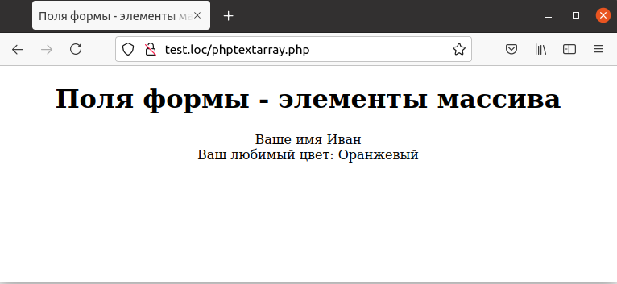

## 6.6 Организация полей форм в массивы  
Существует интересная возможность организации данных, введенных в различные поля HTML-формы, в массивы. Например, имеется форма с двумя текстовыми полями — имя пользователя и его любимый цвет — и требуется запомнить эти данные в элементах массива `$text['name']` и  `$text['color']` соответственно.  
Для этого в качестве имени поля следует использовать выражение с квадратными скобками вида `textdata[name]`, как показано на примере 6.7.  

Пример б.7. Описание формы с полями-элементами массива, phptextarray.html  
```php
<HTML>
    <HEAD>
        <TITLE>Использование текстовых полей</TITLE>
    </HEAD>
    <BODY>
        <CENTER>
            <H1>Использование текстовых полей</H1>
            <FORM  METHOD="POST"  ACTION="phptextarray.php">
                Введите Ваше имя:
                <INPUT NAME="textdata[name]" TYPE="TEXT">
                <BR></BR>
                Ваш любимый цвет:
                <INPUT NAME="textdata[color]" TYPE="TEXT">
                <BR></BR>
                <INPUT TYPE=SUBMIT VALUE="OK">
            </FORM>
        </CENTER>
    </BODY>
</HTML>
```  
  
Рис. 6.6. Форма с полями-элементами массива  

Для того чтобы сохранить введенные данные в массиве `$text`, используется соответствующий элемент массива [$_REQUEST](https://www.php.net/manual/ru/reserved.variables.request.php), как показано на примере 6.8. 

Результат выполнения примера приведен на рис. 6.7.  
  
Рис. 6.7. Содержание формы с полями-элементами
массива  

Пример 6.8. Поля формы — элементы массива, phptextarray.php  
```php 
<HTML>
    <HEAD>
        <TITLE>
            Поля формы - элементы массива
        </TITLE>
    </HEAD>
    <BODY>
        <CENTER>
            <H1>
                Поля формы - элементы массива
            </H1>
            Ваше имя
            <?php
                $text = $_REQUEST ['textdata'];
                echo $text['name'], "<BR>";
            ?>
            Ваш любимый цвет:
            <?php
                echo $text['color'], "<BR>";
            ?>
        </CENTER>
    </BODY>
</HTML>
```  
Организация данных в массивы может быть удобна для построения сложных
форм с большим количеством полей.
