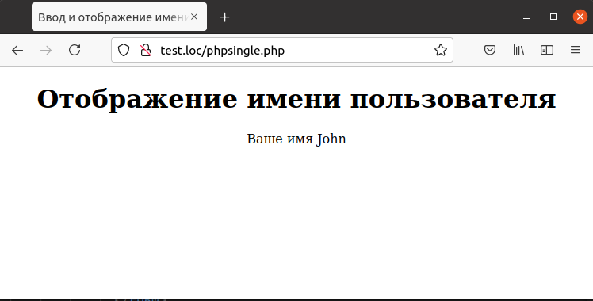

## 6.7 Приложение из одной страницы  
До этого момента все рассмотренные web-приложения использовали два файла — статическую HTML-страницу, содержащую описание формы для ввода
данных, и скрипт-обработчик на РНР. Но большое количество web-приложений используют единственный PHP-файл, который содержит весь необходимый код.  
Например, требуется разработать приложение, которое запрашивает имя пользователя и затем отображает его — все при помощи одного скрипта.
Для этого требуется уметь определять, первый ли это запуск скрипта, и в этом случае показывать форму для ввода данных (часто ее называют заглавной страницей). С другой стороны, если пользователь уже ввел данные, то их требуется обработать. В данном примере используется текстовое поле с названием `"Name"`,в которое пользователь вводит свое имя.  
Если пользователь ввел данные,они будут содержаться в элементе массива [`$_REQUEST ["Name"]`](https://www.php.net/manual/ru/reserved.variables.request.php). Если же это первый запуск скрипта, следует сформировать форму для ввода данных, как это сделано в примере 6.9.  

Пример 6.9. Web -приложение в одном скрипте, phpsingle.php
```php 
<HTML>
    <HEAD>
        <TITLE>
            Ввод и отображение имени пользователя
        </TITLE>
    </HEAD>
    <BODY>
        <CENTER>
        <?php
            if (isset ($_REQUEST ["Name"]))
            {
        ?>
              <H1>Отображение имени пользователя</H1>
              Ваше имя
        <?php
              echo $_REQUEST ["Name"];
            }
            else
            {
        ?>
              <H1>Ввод имени пользователя</H1>
              <FORM METHOD="POST" ACTION="phpsingle.php">
                 Введите Ваше имя
                 <INPUT NAME="Name" TYPE="TEXT">
                 <BR><BR>
                 <INPUT TYPE=SUBMIT VALUE="OK">
              </FORM>
        <?php
        }
        ?>
        </CENTER>
    </BODY>
</HTML>
```  
Следует отметить, что использование атрибута `ACTION` в теге `FORM` является необязательным, так как в случае его отсутствия управление при нажатии кнопки отправки «ОК» будет передано текущему документу. Результат первого запуска скрипта приведен на рис. 6.8, а после ввода имени пользователя и нажатия кнопки «ОК» экран примет вид, изображенный на рис.6.9.  

   
Рис.6.8. Запрос имени пользователя  

  
Рис. 6.9. Отображение имени пользователя  
