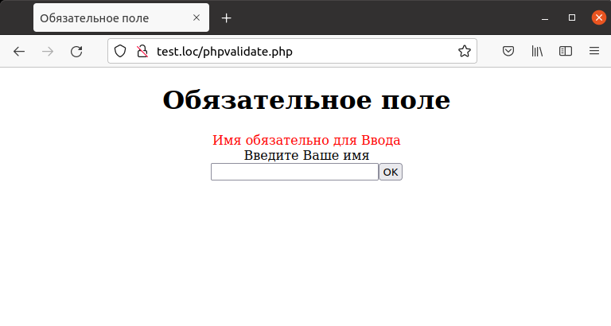

## 6.9 Обязательное для заполнение поле 
Проверка на наличие данных в определенном поле требуется достаточно часто. Например, приложение запрашивает у пользователя его имя (см. рис. 6.8) и отображает его (см. рис. 6.9). Если поле заполнено, все функционирует корректно. Но что делать в том случае, если пользователь оставил текстовое поле пустым? Для этого функция `validate_data` выполняет проверку на наличие данных в поле `Name` и в случае, если это не так, добавляет сообщение об ошибке
в массив `$errors`:  
Функция `process_data` просто отображает введенное имя, а функция `display_form` выводит форму с единственным текстовым полем. Все приложение целиком приведено в примере 6.10.

Пример б.10. Поле, обязательное для ввода, phpvalidate.php  
```php
<HTML>
    <HEAD>
        <TITLE>
            Oбязательное поле
        </TITLE>
    </HEAD>
    <BODY>
        <CENTER>
            <H1>Oбязательное поле</H1>
            <?php
                $errors = array ();
                if (isset ($_REQUEST["seen_already"]))
                {
                    validate_data();
                    if (count($errors) > 0)
                    {
                        display_errors();
                        display_form();
                    }
                    else
                    {
                        process_data();
                    }
                }
                else
                {
                    display_form();
                }
                function validate_data()
                {
                    global $errors;
                    if ($_REQUEST ["Name"] == "")
                    {
                        $errors[]="<FONT COLOR='RED'>Имя обязательно для
                        Ввода</FONT>";
                    }
                }
                function display_errors()
                {
                    global $errors;
                    foreach ($errors as $err)
                    {
                        echo $err, "<BR>";
                    }
                }
                function process_data()
                {
                    echo "Ваше имя ".$_REQUEST ["Name"];
                }
                function display_form()
                {
                    echo "<FORM METHOD='POST' ACTION='phpvalidate.php'>";
                    echo "Введите Ваше имя";
                    echo "<BR>";
                    echo "<INPUT NAME='Name' TYPE='TEXT'>";
                    echo "<BRxBR>";
                    echo "<INPUT TYPE=SUBMIT VALUE='OK'>";
                    echo "<INPUT TYPE=HIDDEN NAME='seen_already'
                    VALUE= 'data'>";
                    echo "</FORM>";
                }
            ?>
        </CENTER>
    </BODY>
</HTML>
```  
Теперь, если пользователь не ввел ничего в текстовое поле, будет отображено сообщение об ошибке, как показано на рис. 6.10.  
  

Рис. 6.10. Обязательное поле не заполнено

